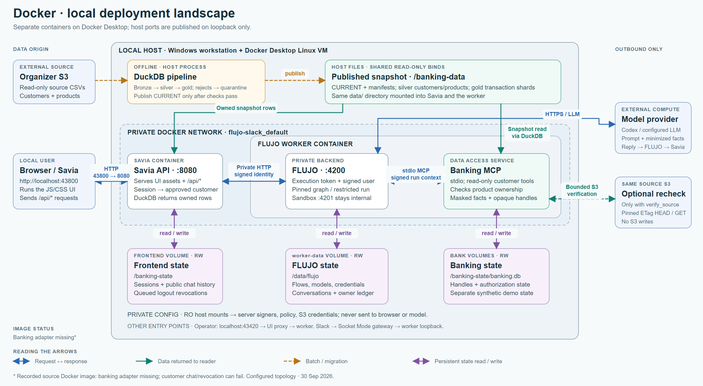
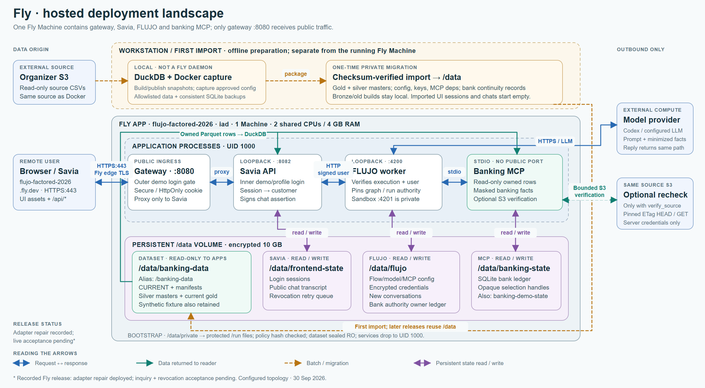

# Factored AI & Data Hackathon 2026 — MCG

This repository contains the data audit, DuckDB pipeline, classifier baseline, banking MCP and **Savia**, a customer-facing prototype for unrecognized-charge inquiries. The runnable, isolated preview uses fictional customers, products and transactions; a separate private mode can read an approved organizer silver/gold snapshot with fictional name aliases. The merged direct-host/MCP source candidate is described in [frontend/DIRECT_MCP.md](frontend/DIRECT_MCP.md). The [earlier worker-ingress intake and handoff prototype](docs/SIMULATED_INTAKE_V0.md) is historical. An intake does not resolve a dispute or issue a refund.

## CI runs locally

Hourly CI runs on the local Windows computer and disposable Docker Linux
containers: five Windows jobs and six Linux jobs for one exact source commit.
The daily Modal CPU run is an additional Linux cross-check. The avatar-server
memory incident does not pause CI. See [the local CI policy](docs/LOCAL_CI.md)
for execution, resource bounds and truthful GitHub evidence.

## FLUJO product boundary

FLUJO is a long-lived, general-purpose product. Keep its main branch and default
build free of banking or hackathon backend code, routes, policy and dependencies.
Use existing generic interfaces; keep product-specific behavior in Savia and the
banking MCP where possible. The owner-authorized FLUJO
[`codex/hackathon-banking` branch](https://github.com/mario-andreschak/FLUJO/tree/codex/hackathon-banking)
preserves the reversed hackathon integration separately from generic main.
See the [architecture boundary and review gate](docs/FLUJO_PRODUCT_BOUNDARY.md)
and [deployment source map](docs/FLUJO_HACKATHON_DEPLOYMENT.md).

## Run the fictional preview

Follow the [isolated synthetic invitation preview](frontend/README.md#isolated-synthetic-invitation-preview) from a clean checkout. It installs Python and Node dependencies, generates a private fixture and owner-bound invitations, builds the frontend, and starts a local loopback server. Sign in with an invitation from the generated private file. The preview supports owned transaction lookup and charge review, with assisted action disabled. It does not start FLUJO, MCP, a model or a human handoff. The Linux dependency and local browser checks are recorded in the private release evidence. A bounded native Windows setup and owner-bound loopback API probe passed at source `3238465f5167cf3ba471cea6d9409a19b103781f`; the served Windows page, current UI changes and joined FLUJO/MCP runtime were not checked there.

A separate [private organizer-snapshot setup](frontend/README.md#run-beside-the-existing-flujo-worker) is described for the existing local Docker deployment at [localhost:43800](http://localhost:43800). It requires approved data, private configuration and a configured access code; no working default is included. Its source and local UI are not evidence of a joined or deployed customer journey. See [dataset, architecture and verification evidence](docs/ONLINE_BANKING_FRONTEND.md) for the supported paths and limitations. The frontend image contains neither customer rows nor service credentials.

## Docker and Fly deployment landscapes

The diagrams show the captured configurations reviewed on September 30, 2026:
where source data enters, how it reaches the frontend API and banking MCP, how
users connect, and which network, process and storage boundaries protect it.
The banking integration shown belongs to the dedicated hackathon runtime
described in the [deployment source map](docs/FLUJO_HACKATHON_DEPLOYMENT.md).

### Docker: local containers



### Fly: hosted Machine



Download the [two-page landscape PDF](docs/architecture/deployment-landscapes.pdf),
[Docker SVG](docs/architecture/docker-landscape.svg),
[Fly SVG](docs/architecture/fly-landscape.svg), or
[self-contained viewer with zoom and descriptions](docs/architecture/deployment-landscapes.html).
See [configuration details and evidence](docs/architecture/landscape-notes.md)
for the separate screen/chat read paths, optional S3 verification, persistence
and recorded runtime limitations. The source Docker image's banking-adapter
omission and Fly's pending customer inquiry/revocation acceptance are marked;
these diagrams do not establish successful live acceptance.

## Start here

- [Playable development history and rebuild instructions](docs/DEVELOPMENT_HISTORY.md)
- [FLUJO product boundary for this hackathon](docs/FLUJO_PRODUCT_BOUNDARY.md)
- [Dedicated FLUJO hackathon branch and deployment source map](docs/FLUJO_HACKATHON_DEPLOYMENT.md)
- [Data recovery review and local runbook (September 29)](docs/DATA_RECOVERY_2026-09-29.md)
- [Current banking MCP implementation and measured limits](docs/BANKING_MCP_IMPLEMENTATION.md)
- [Current operator demo](docs/BANKING_OPERATOR_DEMO.md)
- [Hackathon audit and delivery plan](docs/HACKATHON_AUDIT_PLAN.md)
- [Hackathon supervision and October 3 team target](docs/HACKATHON_SUPERVISION.md)
- [Transaction dispute workflow, contributor credit and qualification](docs/DISPUTE_IMPLEMENTATION.md)
- [Direct S3 data review](docs/DATA_REVIEW_2026-09-26.md)
- [Channel clarifications on dataset quality (September 30)](docs/CHANNEL_DATA_CLARIFICATIONS_2026-09-30.md)
- [Banking MCP direct S3 plan](docs/BANKING_MCP_S3_PLAN.md)
- [FLUJO customer-bound banking run design](docs/FLUJO_BANKING_RUN_AUTH.md)
- [FLUJO proposal review, alternatives and executed evidence](docs/FLUJO_BANKING_RUN_AUTH_REVIEW.md)
- [DuckDB data pipeline and snapshot serving option](pipeline/README.md)
- [Banking MCP: tools, local FLUJO connections and identity contract](banking_mcp/README.md)
- [Banking MCP implementation and executed checks](docs/BANKING_MCP_IMPLEMENTATION.md)
- [Aggregate profile](docs/DATA_PROFILE_AGGREGATES_2026-09-26.json)
- [Challenge and dataset references](docs/reference/)
- [S3 profiling script](scripts/profile_s3.py)

The full scan found **12,297 unrecognized-charge complaints** and **4,425,008 transactions** with valid customer/product ownership. Historical complaint links are unusable for the proposed customer workflow: all complaint origin-interaction IDs are empty, and every populated affected-product ID belongs to another customer. See the review for methods, denominators, and limits.

## Local S3 profiling

Install the dependency and copy the configuration template:

```powershell
python -m pip install -r requirements-s3.txt
Copy-Item S3credentials.env.example S3credentials.env
```

Fill `S3credentials.env` privately, then run:

```powershell
python scripts/profile_s3.py
```

The script reads S3 objects and writes only aggregate counts to `docs/DATA_PROFILE_AGGREGATES_2026-09-26.json`. It does not save source rows or credentials. The local env file, raw data, and `private/` source materials are ignored by Git. The data dictionary under `docs/reference/` has its credential page redacted.

## Repository layout

| Path | Purpose |
| --- | --- |
| `docs/` | Plan, evidence report, and aggregate JSON |
| `docs/reference/` | Organizer PDFs, including a redacted data dictionary |
| `scripts/` | Reproducible profiling and FLUJO review probes |
| `pipeline/` | DuckDB ingestion, ownership validation and customer-sharded snapshot outputs |
| `banking_mcp/` | Read-only MCP server with verified per-call authority and bounded transaction reads |
| `frontend/` | Savia React UI, authenticated snapshot API, FLUJO customer chat and portable Docker deployment |
| `notes/` | Team idea notes |
| `private/` | Local-only original credential-bearing reference |

The banking MCP uses Carlos's customer-sharded Parquet snapshots for lookup and conditional S3 read-back of a selected transaction. Customer reads require signed per-call authority outside model arguments. FLUJO #534 removed the banking adapter and in-worker integration from generic main; their combined source is now preserved on the dedicated hackathon branch. Existing measurements describe older revisions, not acceptance of a newly deployed branch.

At the October 1, 2026 observation, project PRs [#31](https://github.com/mario-andreschak/factored-hackathon-2026-mcg/pull/31), [#32](https://github.com/mario-andreschak/factored-hackathon-2026-mcg/pull/32), [#35](https://github.com/mario-andreschak/factored-hackathon-2026-mcg/pull/35) and [#39](https://github.com/mario-andreschak/factored-hackathon-2026-mcg/pull/39) were merged into `origin/main` at `eea3e29d081c30840e0512a6438e5de81a0ea70c`. The merged PR #39 source includes the protected graph hash and R16 denial-test corrections at `92054ac15bb455303217fa501fbd7c13ceb14e93`. Independent checks of that source were limited to source and synthetic tests; the exact-head [push](https://github.com/mario-andreschak/factored-hackathon-2026-mcg/actions/runs/36873585491) and [PR](https://github.com/mario-andreschak/factored-hackathon-2026-mcg/actions/runs/36873593351) GitHub Actions runs passed 11/11 jobs each.

The later main-merge Actions run [started no test steps](https://github.com/mario-andreschak/factored-hackathon-2026-mcg/actions/runs/36878918305): all 11 jobs were blocked by a GitHub account billing or spending-limit annotation, so that run gives no source-test result.

[PR #40](https://github.com/mario-andreschak/factored-hackathon-2026-mcg/pull/40) subsequently merged normally at `331056831aebb4e484e82356f74af86cc97d2284` on October 1, 2026, after all eleven exact-head private workflow jobs passed at `f150c989eee9d3cbd5ac4870b66b56e5addd8fb3` and independent source review completed. This PR #41 integration incorporates that descriptive transaction dispute workflow source while retaining the mobile sidebar scroll fix. The naming source preserves the portal/preview source and corrects its preparation manifest hash. Its [combined source qualification](docs/qualification/dispute-naming-source-2026-10-01.json) records frozen `ea8f62176157cb016ff07db86c8d2e8c49272aa9`: 1,725 source tests and 428 subtests, all 85 protected hashes, 80 UI tests/build, and fictional owner-bound read-preview checks. Those results retain that frozen scope; the mobile CSS change requires its own current-head CI and does not extend the report's 190-file source capture. The earlier `ad685790` manifest and R16 test failures were repaired; all historical reports remain pinned to their measured snapshots. The [private workflow CI route](docs/DISPUTE_ACCEPTANCE.md) executes all eleven exact-head jobs on Windows and Docker Linux, publishes separately named external evidence only after complete receipt validation, and respects branch policy. GitHub-hosted billing refusals retain their original conclusions.

The graph remains uninstalled with actions disabled. Native/provider execution, verified customer outcomes, human acceptance and deployment remain unqualified for this renamed artifact. Bank keys, raw record identifiers, selection/action capabilities and generic S3 credentials must not reach the language flow.
