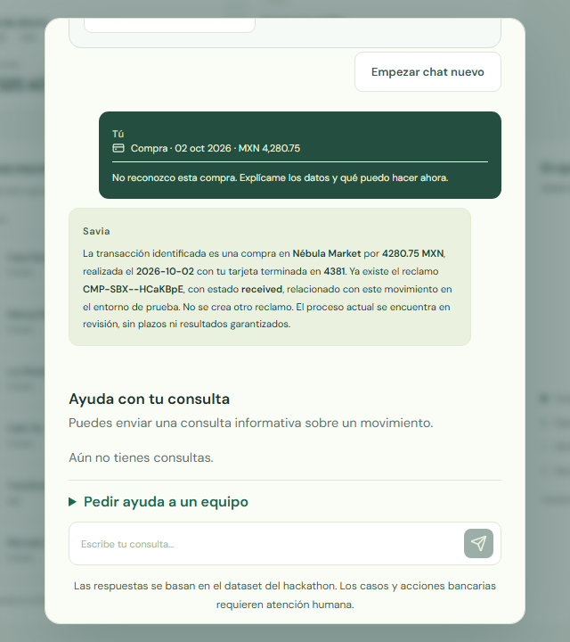
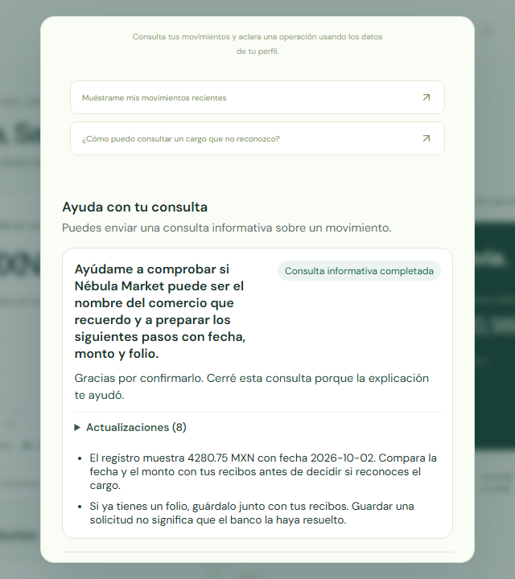

# Savia — Ask once. Savia follows through.

**One voice assistant. A question that keeps its context. A useful next step when you return.**

“I don't recognize this transaction.” For a customer, that starts a problem that can take more than one conversation to solve. Savia brings checked transaction facts, Spanish and Portuguese conversation, specialist perspectives and saved follow-up into one place.

**[Open the submission: pitch, film, demo and development story](https://savia-rc-2026.fly.dev/submission/)**

**[Try Savia](https://savia-rc-2026.fly.dev)** · entry and fictional profile code: **`SAVIA-2026`**

**[Watch the 2:21 customer film](https://github.com/mario-andreschak/factored-hackathon-2026-mcg/releases/download/v0.1.0-rc.2/savia-submission.mp4)** · **[Six-slide product pitch](docs/submission/media/decks/final/savia-final-pitch.pdf)** · **[Editable slides](docs/submission/media/decks/final/savia-final-pitch.pptx)**

## Your problem keeps moving. You get on with your day.

Select the unfamiliar charge and ask Savia what is known. The transaction stays visible while Savia explains the merchant, date, amount and status. Ask its team to compare the evidence and next steps. Return to the same inquiry, read the saved suggestions, and hear the recommendations.

Our recorded prototype shows a grounded answer, **two actual completed model reviewers**, a customer marking the explanation helpful, and the saved answer and suggestions surviving a new chat and reload. These are real model calls over fictional bank data.

## Voice is the beginning. Follow-through is the product.

The customer should not need to repeat the whole problem each time. Savia saves the inquiry, work status, checked facts and recommendations. Its voice lives inside the customer assistant; completed updates wait for foreground speech to finish. Bank intake, informational answers and human handoff remain distinct states so the customer sees what actually happened.

The frozen customer recording includes **two complete native voice replies and exact full-playback acknowledgments**. A later saved-recommendation capture speaks useful advice and retains the result after reload. A separate automatic receipt check ran after **30 real minutes** without duplicating the visible update.

**“Block my card.”** The new protection flow lets a customer select their own fictional card, confirm the block and receive a verified saved receipt. The blocked status survives a new login. Spanish and Portuguese requests open the same consent flow; asking alone never blocks the card. [Working action, recovery and concurrency checks](docs/submission/measurements/CARD_BLOCK_VERIFICATION.md).

[Savia and the ElevenLabs commercial reference](docs/submission/ELEVENLABS_COMPARISON.md) explains the product positioning and the implemented case lifecycle, with links to the recorded successes.

## One conversation. A team behind it.

One assistant stays with the customer while specialists compare evidence, explore alternatives and return reviewed findings. The prototype demonstrates two reviewers. The larger architecture connects ten teams, each with one lead and nine specialists: **up to 100 team conversations**, with Savia's root separate.

The foundation has completed collaboration exercises with **18 Fly sandboxes live together**, and a separate FLUJO workload returned **300/300 correct reference codes from 300 concurrent client submissions**. The larger customer fleet is a distinct integration: its latest root request failed before delegation when the provider workspace was disabled. The successful two-reviewer story and infrastructure tests keep their own measured scope. [Capacity and collaboration evidence](docs/submission/measurements/INFRASTRUCTURE_CAPACITY.md).

## The bank controls the stack. The work leaves a trace.

Savia owns the customer experience and durable inquiry. The trusted host resolves customer-owned selections and explicit consent. Banking MCP owns data, policy and action receipts. FLUJO supplies general orchestration interfaces; language models receive only permitted context and cannot authorize bank actions themselves.

The pipeline accounts for every source row, records lineage, quarantines invalid records and publishes an immutable snapshot only after a successful build. An ownership defect in historical complaint links changed our product decision: **new inquiries use owned transactions rather than unreliable complaint-to-product joins**. The same analysis found only 42 distinct transcript texts across 171,321 records, so we built a separate bilingual routing diagnostic instead of presenting template memorization as model quality.

**New local verification:** GPT-6 Luna completed **100 concurrently submitted Spanish/Portuguese fixture requests**, with 100/100 exact grounded decisions and zero observed forbidden actions. This subscription-backed provider test covers owned facts, ambiguity, foreign-owner injection, false refund claims and requested handoff, using ten distinct request phrasings with varied fictional facts. Its predeclared deterministic baseline also scores 100/100. [Full workload, outputs and replay instructions](docs/submission/measurements/luna-100/README.md).

## Make “I'll look into it” a service customers can feel.

For customers, the ambition is less chasing and less repeating. For the bank, it is clearer evidence and a better prepared handoff. Transaction disputes are the first focused workflow. A bounded bank pilot would measure repeat contacts, helpful answers, handoff quality and cost per case.

**The demonstrated product is a fictional banking prototype.** Simulated intake requires confirmation and a verified receipt; it does not establish a refund. Helpful informational closure does not resolve a bank dispute. Production bank execution, live human pickup, push/email delivery and week-long reliability remain pilot work.

Built by **Gloria Yanta Salc** (prompt flow and decision design), **Carlos Diaz** (data pipeline and lookup), and **Mario Andreschak** (integration and orchestration).

---

## Review the working evidence

The human pitch above explains the product. This table maps technical claims to inspectable source and measured artifacts. Results identify their workload and revision; historical successes and later failed experiments retain their separate scopes.

**[Start the independent review](docs/submission/START_HERE.md)** · **[Evidence map](docs/submission/EVIDENCE_MAP.md)** · **[Development story and contributor decisions](docs/submission/DEVELOPMENT_PROCESS.md)**

**Fresh public replay:** [67 passing existing offline checks and 11 pipeline/analytics invariants](docs/review/PUBLIC_EVIDENCE.md), plus a paired uncertainty analysis of the unchanged routing diagnostic. Run `python scripts/review_evidence.py --out docs/review` after installing `requirements-review.txt`. [Exact source hashes and results](docs/review/replay-receipt.json).

| Evaluation dimension | What to inspect | Evidence |
| --- | --- | --- |
| Technical judgment | Owned reads; explicit consent; signed action admission; durable receipt and restart recovery; safe uncertainty | [Immediate card action and 100-confirmation proof](docs/submission/measurements/CARD_BLOCK_VERIFICATION.md), [action host](dispute_workflow/action_host.py), [bank actions](banking_mcp/actions.py), [direct-host contract](frontend/DIRECT_MCP.md) |
| AI engineering | Integrated customer UI and voice; two actual reviewers; saved results and return visit; deployed source/image identities | [Customer story](docs/submission/CUSTOMER_JOURNEY.md), [release and runtime pins](docs/submission/RELEASE_CANDIDATE.md), [two-reviewer receipt](docs/submission/measurements/team-story-summary.json), [saved speech proof](docs/submission/measurements/saved-recommendations-native/README.md) |
| Data engineering | Immutable publication; last good snapshot preserved on failure; lineage; customer isolation; late arrivals and corrections | [Pipeline reproduction](pipeline/README.md), [pipeline tests](tests/test_pipeline.py), [row accounting](docs/pipeline/quality_report.md), [source review](docs/DATA_REVIEW_2026-09-26.md) |
| Machine learning | Fixed bilingual holdout; keyword/TF-IDF/abstention comparison; 100 concurrent Luna fixture decisions with a deterministic oracle; leakage disclosure | [120-case comparison](docs/demo/intent_router_evaluation.md), [100-case Luna workload and outputs](docs/submission/measurements/luna-100/README.md), [executable evaluator](demo/evaluate_router.py), [holdout provenance](docs/ml/router_holdout_provenance.md) |
| Data analytics | Outcome/error/grounding/latency metrics; data findings that change product choices; customer and infrastructure denominators | [Measured operating decisions and charts](docs/review/OPERATING_DECISIONS.md), [reproduction script](scripts/analyze_operating_evidence.py), [operational aggregation](analytics/README.md), [customer measurements](docs/submission/measurements/MEASURED_RESULTS.md) |

**Quality evidence:** the routing diagnostic has 120 balanced cases (60 Spanish / 60 Portuguese), AI-authored labels, and independent human adjudication pending. The TF-IDF classifier's diagnostic accuracy is 78.3% versus the keyword baseline's 58.3%; this measures routing against those labels. The original customer comparison is n=3 across revisions, with 2/3 agent-screened useful replies. Neither result estimates production banking resolution or business ROI.

**Successful recording versus fleet extension:** the frozen film shows completed two-reviewer work, useful saved results and voice. The newer fleet attempt preserves its failed initial root call. A recorder's optional cleanup timeout is separately documented from accepted product steps. See the [release scope](docs/submission/RELEASE_CANDIDATE.md) and [original receipts](docs/submission/measurements/MEASURED_RESULTS.md).

## Reproduce locally

| Path | Command or setup | Scope |
| --- | --- | --- |
| Public demo | [Savia](https://savia-rc-2026.fly.dev), code `SAVIA-2026` | Fictional profiles; real configured model and voice calls |
| Isolated preview | [Frontend setup](frontend/README.md#isolated-synthetic-invitation-preview) | Generated fixtures; no model, MCP or bank action |
| Local workflow | [RC startup](deploy/rc/README.md) | Durable inquiries and simulated ledger; explicit provider profile |
| Pipeline | [Pipeline setup and fixture](pipeline/README.md) | Public synthetic fixture; private organizer access separate |
| Router evaluation | [ML setup](ml/README.md) and [frozen evaluator](demo/evaluate_router.py) | Fixed diagnostic workload; no provider calls |
| Public evidence replay | `python -m pip install -r requirements-review.txt`, then `python scripts/review_evidence.py --out docs/review` | Public six-table fixture, offline checks, fixed router and analytics replay |

We checked the [Factored Hugging Face catalog](docs/review/FACTORED_HF_ASSESSMENT.md) for a relevant baseline. Its published recruiting/sales tasks do not match this banking workflow. Model choice follows measured task fit.

## Architecture and development

| Directory | Responsibility |
| --- | --- |
| `frontend/`, `frontend/src/avatar/` | Customer portal and integrated voice |
| `savia_assistant/` | Durable inquiries, reviewer work and scoped fleet connector |
| `banking_mcp/`, `dispute_workflow/` | Banking reads, consent, simulated actions and recovery |
| `pipeline/`, `ml/`, `analytics/` | Data preparation, routing diagnostics and operational analysis |
| `resources/`, `contracts/` | Prompts, synthetic policy and workflow contracts |
| `deploy/`, `scripts/` | Immutable builds, runtime setup and reproducible checks |
| `docs/submission/` | Customer evidence, measurements, recording and decks |

**FLUJO main stays general purpose.** Domain code lives here, in Banking MCP, or on the owner-authorized isolated hackathon branch. Read the [product boundary](docs/FLUJO_PRODUCT_BOUNDARY.md), [deployment source map](docs/FLUJO_HACKATHON_DEPLOYMENT.md) and [system landscape](docs/architecture/system-landscape.md).

[Documentation index](docs/README.md) · [local CI policy](docs/LOCAL_CI.md) · [submission guide](docs/SUBMISSION_GUIDE.md) · [implementation credits](docs/DISPUTE_IMPLEMENTATION.md)
