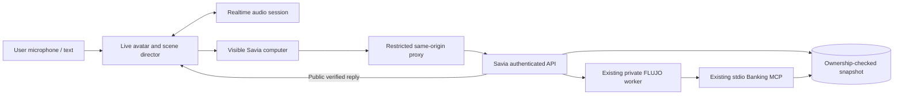

# Elsewhere: cinematic voice layer over Savia

Reviewed 1 October 2026. Elsewhere is a separate application in `avatar/`. Its
characters, scene direction, voice transport and embedded computer are presentation
and interaction. Savia and its existing FLUJO/Banking MCP path retain customer
authentication, ownership, approved workflow selection and verified banking facts.

The default experience follows a video-game opening: black screen, drawn eyes,
then a user gesture admits voice. With a transcription-capable provider, a completed
utterance determines the companion and world. Persistent chat forms, explanatory
captions and dashboard chrome do not
belong in normal play; optional pause controls expose text input, transcript,
presentation overrides and accessibility settings. Characters and in-scene surfaces
provide the normal interaction. The forest companion travels deliberately between
ten original rendered scenes, with ambient animation; compatible live providers
can supply voiced direction. Native Gemini Live, OpenAI Realtime or an explicitly
selected PersonaPlex candidate supplies conversational audio. PersonaPlex uses a
fixed launch role and has no native user-ASR, live persona switch or tool-result
channel. Optional external recognition supplies user text and intent scenery
while preserving that voice role; it does not delegate bank tasks or narrate results.
A silent
visual preview is available without a usable native provider; browser device TTS
and a chained transcription/chat/speech adapter are not the default experience.

## Source and deployment facts

The primary checkout starts at `6c6cef705ac4d62c0c0224e8ad3451afc803efc1`, whose
README describes an early planning stage. Authenticated GitHub inspection confirmed
the project main branch at `e5a34e4aab6a80328197dba51d79c920aeb8302f`, committed
1 October 2026 at 05:03:55 UTC. Read the current docs at that immutable revision
when interpreting older proposals. A source capability is not an installed feature.

The existing local Savia service at `http://127.0.0.1:43800` was checked through
its public profile endpoint and a read-only introspection of the installed Python
module. Its installed routes contain authenticated read APIs and chat, with no
`/api/action/*` routes. The running worker is
`flujo-slack-worker:banking-auth-20260930`. Deployment repair evidence in
`deploy/local-banking/README.md` records successful read-only customer inquiry,
history restoration and exact-session revocation. This avatar component neither
replaces that worker nor enables bank actions.

The later source on project main contains simulated-intake and saved-human-request
contracts. Those require matching reviewed Savia, FLUJO and MCP revisions, explicit
portal consent, durable request identity and independent receipt readback. Their
joined customer acceptance remains separate. This component must not say that it
filed a dispute, issued a refund, blocked a card or connected a human based on a
voice response or animation.

FLUJO's generic main branch must remain free of banking/hackathon adapters. The
owner-authorized `codex/hackathon-banking` branch preserves the separate integration.
Elsewhere needs no changes to either FLUJO source or its approved banking policy.
See the project's [product boundary](https://github.com/mario-andreschak/factored-hackathon-2026-mcg/blob/e5a34e4aab6a80328197dba51d79c920aeb8302f/docs/FLUJO_PRODUCT_BOUNDARY.md)
and [deployment source map](https://github.com/mario-andreschak/factored-hackathon-2026-mcg/blob/e5a34e4aab6a80328197dba51d79c920aeb8302f/docs/FLUJO_HACKATHON_DEPLOYMENT.md).

## Two independent speeds

The live character acknowledges, listens, changes pace and supports interruption.
Long work continues through the existing Savia workflow. It must not fill a waiting
period with invented account facts. Its success signal is the actual Savia reply;
animation timing is not evidence that a banking tool completed.

An interruption cancels or suppresses the character's current spoken response and
returns attention to the user. The installed Savia API has no customer cancellation
route. A previously admitted read may continue. Keep its result correlated with
the request, and recover an active inquiry from authenticated history instead of
resubmitting it. Do not claim that silencing the character cancelled banking work.

Character selection is an interaction preference, not a financial or psychological
decision. The user can select another character. For PersonaPlex, changing away
from its fixed launch role disconnects native voice and continues in visual preview;
it does not change the already initialized model. With transcript routing,
calm/emotional language favors the
ancient forest companion; practical requests favor the measured companion; requested
energy favors the fast companion. A distress or security signal cannot authorize a
bank action. The high-energy character still states facts accurately and respects
requests to slow down or stop.

## Why the computer is a real embedded application

The reference [MCP Virtual Computer](https://github.com/flujo-app/mcp-virtual-computer)
provides a Three.js computer, a real Xfce desktop delivered through noVNC, and
visible mouse/keyboard activity. Its current README and source were reviewed in the
local checkout at `e06594866d33847c591c8d0192e2861b7132c9b9`. Its current persistent
Docker/Fly behavior supersedes inherited Kilntainers specifications that describe
ephemeral sandboxes. It is MIT licensed. No code from that project is required here.

Elsewhere can embed the existing Savia browser UI directly. A forest pond and the
other characters' computer surfaces frame the real document. This avoids adding an
operating system, VNC service or second browser identity solely for the visual scene.
It also gives the user ordinary, responsive controls for login, transactions and chat.

Savia intentionally sends `X-Frame-Options: DENY` and CSP `frame-ancestors 'none'`.
The installed local endpoint confirmed these headers. The Fly gateway independently
adds the same framing restriction. A direct iframe of local or hosted Savia therefore
does not work.

The optional `/savia/` proxy has one deployment-configured target; it is not a URL
fetcher. It permits the known read-only API surface and frontend assets, rewrites
absolute asset and API paths beneath `/savia/`, and changes framing policy only for
that fixed target to permit the same-origin parent. Keep the rest of the upstream
CSP, content-type protection and no-store behavior. Do not expose FLUJO `/v1`,
administration routes, arbitrary paths, or the later `/api/action/*` source routes.
Client input cannot select another upstream.

The user enters credentials in Savia. The avatar must not ask the user to speak a
password, access code, national ID or full card number. The parent bridge should
observe permitted UI actions and public chat output, rather than reading or logging
login input values. A real click, input change and submit should drive the actual
Savia UI; an animated cursor alone must not be presented as executed automation.

## Installed Savia HTTP contract

Paths in this table are upstream paths. The avatar proxy prefixes them with `/savia`.
There is no browser-provided customer ID or conversation ID in the chat contract.

| Method and path | Request / result |
| --- | --- |
| `GET /api/auth/profiles` | Demo: `{profiles:[{id,alias,country,segment,description,primary_currency}],demo:true}`. Invite mode: `{mode:"invite",demo:true,profiles:[]}`. |
| `POST /api/auth/login` | Demo JSON `{profile,code}`. Result `{authenticated:true,auth_mode,profile}` and session cookie. |
| `POST /api/auth/invite` | Invite JSON `{code}`; the server derives the one permitted fictional profile. Same result shape. |
| `GET /api/auth/me` | Current `{authenticated:true,auth_mode,profile}`, or `401`. |
| `POST /api/auth/logout` | `204`, session-cookie removal and `X-Banking-Revoke`; a persistence failure returns `503`. |
| `GET /api/overview?limit=500` | Owned profile, products, summary, first transaction page and snapshot/pagination metadata. Limit is 1–500. |
| `GET /api/transactions` | Filters `product`, `status`, `q`, `month=YYYY-MM`, `limit=1..500`, `offset>=0`. Result `{transactions,metadata}`. |
| `GET /api/chat/status` | `{available,mode,read_only:true,reason?}`. Requires session. |
| `GET /api/chat/history` | `{available,messages:[{role:"user"|"assistant",text,selection?}],active,limited?}`. Owned public transcript only. |
| `POST /api/chat/messages` | JSON `{message,transaction_reference?}`. Alias `POST /api/chat`. Non-streaming result `{reply,mode:"flujo",status}`. |
| `GET /healthz` | Aggregate dataset readiness and chat-revocation diagnostics; no customer identity. |

`message` is a strict string of 1–4000 characters; blank text is rejected. A selected
transaction message is limited to 3600 characters. The public reference matches
`^txn_[a-f0-9]{24}$`; Savia resolves it independently inside the current owner's full
transaction relation and adds bounded facts itself. Extra request fields are denied.
The installed frontend input is capped at 2000 characters. `status` from FLUJO is
`completed` or `waiting_for_input`. There is no SSE/token stream in this API.

One active query is allowed per authenticated Savia session. An overlapping inquiry
returns `429`. The frontend polls history every two seconds when `active:true` after
refresh; closing the dialog preserves the admitted query. Responses/errors are
bounded, and the host adapter's whole-request deadline is 450 seconds. Transport
failure alone is not proof that the workflow failed or that retry is safe.

The stable installed browser selectors are:

| Control / state | Selector or accessible text |
| --- | --- |
| Open assistant | Button text `Hablemos` (`Estado del asistente` when unavailable) |
| Assistant dialog | Title `Tu asistente Savia` |
| Message field | `input[aria-label="Mensaje para el asistente"]` |
| Send | `button[aria-label="Enviar mensaje"]` inside `form.chat-input` |
| Transcript | `.chat-message.user`, `.chat-message.assistant` |
| Pending work | `.chat-thinking` |
| Error | `[role="alert"]` |

These are an adapter contract tied to the installed Savia version. Fail with an
actionable connection message when they change. For its controlled React field,
the bridge uses the native input value setter and a bubbled input event, then the
real form submission path. The parent receives actual activity and result events;
it does not fabricate a successful inquiry.

## Authentication and proxy boundary

Savia's cookie is `flujo_bank_session`, HttpOnly, SameSite=Strict, upstream `Path=/`,
and Secure when configured. The proxy scopes its browser copy to `Path=/savia`.
The avatar server maintains a separate HttpOnly `avatar_session` and associates
only the bank cookie received from that session's proxied traffic. This lets a
same-origin avatar task use the authenticated bank session without exposing it to
JavaScript or accepting a customer/conversation selector. A parent
`GET /savia/api/auth/me` synchronizes and verifies that connection. Logout and
upstream rejection must clear the association.

State-changing Savia API requests require JSON and check Origin/Sec-Fetch-Site.
The restricted proxy first validates the avatar's configured origin, then maps the
request to the fixed configured Savia origin. It preserves upstream authentication
and service-side checks. Never forward a caller-selected Origin or accept arbitrary
Authorization headers as customer identity. Origin checks supplement authentication.

Within Savia, the authenticated profile maps to a private approved subject/customer.
The host signs a short-lived Ed25519 `flujo-ingress+jwt` assertion for audience
`flujo-banking-ingress`, with session expiry and `bank:read` scope, and sends it with
the private execution bearer to `/v1/chat/completions`. FLUJO pins the approved graph
and ownership. Banking MCP independently verifies its fresh per-call authority.
These credentials, keys, raw IDs and upstream conversation IDs remain outside the
avatar browser, avatar prompt, public logs and visual activity feed.

The default server binds loopback. A public deployment requires explicit opt-in,
an exact HTTPS origin, secure cookies and an access-controlled Savia target.
Public paid voice admission is protected by an operator-configured trusted access
gate. Voice may start before banking sign-in so the user can describe the problem;
Savia authentication remains mandatory before any account inquiry. The public
origin server must remain private behind TLS ingress that authenticates visitors,
strips any visitor-supplied gate header, and injects the server-held gate token.
Provider keys remain server-only; the browser receives application audio/WebRTC
transport, never the provider's long-lived API key. Release tests must cover
foreign origins, unsupported upstream paths, cookie isolation and upstream errors.

## Voice-provider contracts and acceptance

### Explicit PersonaPlex candidate

`AVATAR_VOICE_PROVIDER=personaplex` wires `usePersonaPlex` into the game and selects
the fixed `voiceAvatar` from an operator's ready lease. The server and browser
exchange raw PCM through the same-origin relay: mono PCM16LE at 24 kHz in both
directions, with 1,920-sample/80-ms native output frames. It uses one continuous
model stream rather than separate transcription, chat and speech calls. A local
RMS activity signal opens the world after speech; it is not user transcription or
emotion/intent classification. Generated model text supports assistant captions.

Optional `AVATAR_BACKGROUND_ASR=openrouter`, with a server-side OpenRouter key,
tees the existing microphone into bounded completed-utterance recognition. Config
exposes a boolean capability; actual `/transcribe` requires the ready native
connection owner. Its observed user text enters history and intent-based scenery
without changing the launch voice role or submitting a Savia question. Native
audio remains generated by PersonaPlex; `/conversation` and `/speech` stay denied.
See [background observer](./PERSONAPLEX-BACKGROUND-ASR.md) for cancellation and privacy scope.

`POST /api/avatar/personaplex-session` accepts only `{avatar}`. Admission is bound
to the current avatar session, exact origin/access gate, fixed lease epoch and
launch role. Its short-lived one-use ticket upgrades only
`/api/avatar/personaplex`; the server alone holds the Modal connect credential and
dials the fixed private worker. One lease admits one stream for a bounded audition.
Unavailable, consumed or expired leases do not launch or replace a GPU. The game
refreshes availability after disconnect; another audition requires operator setup.
See [PERSONAPLEX_RELAY.md](./PERSONAPLEX_RELAY.md) for the precise bounds.

The worker supports three fixed role prompts but currently permits only the
reviewed `NATM1.pt` voice. Three roles do not establish three qualified voices.
Changing role, typing a fallback request or a bank identity change closes native
voice. The relay forwards microphone audio, but forwards no banking cookie,
Savia sign-in values, backend account data or task result. It implements neither
user ASR nor `delegate_task`/`set_world`, and cannot
narrate the real Savia answer. The optional keyboard/Workbench path remains a
separate visible, authenticated read path; its reply can appear as a caption.

Earlier saved-sample feedback was provisional and later superseded by rejection
of this English voice for the LATAM product. Nine local worker tests
qualify the aiohttp/protocol/lifecycle logic with a fake model; deterministic
browser tests qualify capture/playback handling and fixed-role Game cleanup.
The pre-observer production-image build/unit run passed 68 cases with one optional upstream skip;
the complete browser baseline passed 42 cases with one optional real-upstream skip.
The pre-read-bridge complete observer check passes TypeScript/Vite and 84 units/one optional
skip; the full browser suite passes 46/one optional skip. The corresponding
production image passes read-only UID1000/runtime and disabled-dispatch checks.
Those receipts predate `taskHold` and `AVATAR_NATIVE_READ_BRIDGE=readonly`.
The latter advertises a boolean capability only with PersonaPlex, opted-in
recognition/key and Savia; it grants no account authority. Eleven focused Game,
four new hold and three new Workbench checks pass, as reported by the owners.
The pre-session-policy TypeScript/Vite and 88-unit/one optional skip checks pass. Image
`532b0e2956b4fd43f60cc81386ac3e20e17a6941667ea821f114ea95746f5a70`
also passes the independent restricted runtime/static/private-path/default-
disabled admission checks. The complete browser rerun passes 64/one optional
real-upstream skip, 65 total in 2.3 minutes. Joined live read-bridge acceptance is
separate.
Those deterministic runs do not establish real-provider behavior. A separate
corrected public-audio browser audition now passes native Modal transport and
audible VAD interruption: readiness 1.520 s, first PCM 1.769 s, VAD ACK 129/128
ms and manual ACK 134 ms, zero clock errors, continuous muted zeros and complete
browser/worker cleanup. Physical microphone echo/AEC and a natural human
conversation remain separate qualification. The launcher-only raw acceptance
flag remains false; the paired browser and launcher receipts establish this
bounded result.
The subsequent 120-second minimum new-start policy and per-message avatar-history
correction pass TypeScript/Vite, 93 units/one optional skip and 64 browser cases/
one optional real-upstream skip, 65 total in 2.4 minutes. Image
`64cdc922b49c2e681e09530770e3b68494d4cb06dd11f034f5d22066d499b46b`
passes the restricted runtime/default admission boundaries. Existing sessions
keep their original deadline below the 120-second threshold; this remains a
one-worker/one-stream 600-second supervised profile, not a continuous service.
The [host-Node recipe](SUPERVISED-NATIVE.md) is supported; default Compose has
no lease path/mount and does not qualify PersonaPlex inside Docker.
The later public observer receipt also passes one actual native/ASR/actual-Game
request: one transcription 200 delivered the ten-word rice-cooking request with
matching response/delivery hashes while native PCM continued, followed by mute
and confirmed browser/worker cleanup. It uses no Savia, read bridge or physical
microphone and does not qualify adaptive roles or narration.
An actual A100 offline audition establishes native model loading and voice output.
A separate forced-text test mispronounced a synthetic name and invented a future
promise after the forced segment. The newer closed-gate trial suppresses later
output but fails strict amount/dispute pronunciation, so bank-result speech remains disabled. Native
basic browser acceptance and bank narration are distinct gates.

### Gemini Live

The selected native Gemini path uses a single continuous Live WebSocket session.
The microphone streams raw mono signed 16-bit little-endian PCM at 16 kHz;
native model output is raw PCM at 24 kHz. The provider performs turn detection and
generates conversational audio directly. Transcription events support accessible
history and presentation cues without a separate transcription endpoint. The
browser clears scheduled audio immediately for `serverContent.interrupted` and
explicit interruption, and sends `audioStreamEnd` when pausing the microphone.
See Google's [Live capabilities](https://ai.google.dev/gemini-api/docs/live-api/capabilities)
and [Live WebSocket reference](https://ai.google.dev/api/live).

The avatar's `POST /api/avatar/gemini-token` accepts only `{avatar}` and returns a
short-lived single-use token, fixed model, fixed official constrained WebSocket
endpoint, expiry times and the minimal setup model. The long-lived Gemini key stays
on the server. The operator gate, app session and rate/admission limits protect
token minting even before bank login. The provider token locks the full server
setup: voice, system instruction, modalities, transcriptions and the two reviewed
tools. Browser fields cannot enlarge that authority. The REST provisioning body
uses `bidiGenerateContentSetup`, with nested `generationConfig`, as confirmed
against the official SDK converter; the convenient SDK `liveConnectConstraints`
shape must not be copied unchanged into raw REST.

The default model is `gemini-3.8-live`, with a validated server-only
`GEMINI_LIVE_MODEL` override. Browser setup must exactly match that configured
model and the destination remains Google's fixed constrained endpoint. Model
support matters: Gemini 3.1 Flash
Live does not support asynchronous nonblocking function calls. The native bank
tool uses nonblocking behavior so the character can keep listening while Savia
works. Its eventual response is sent with top-level `scheduling:'WHEN_IDLE'`;
presentation-only world changes use `SILENT`. The current
[official SDK FunctionResponse type](https://github.com/googleapis/js-genai/blob/main/src/types.ts)
places scheduling alongside `id`, `name` and `response`; an older prose example
placing it inside `response` is not the raw protocol contract. Tool call IDs,
session generations and cancellation events prevent duplicate or late results
from crossing voice lifecycles. See [ephemeral token guidance](https://ai.google.dev/gemini-api/docs/live-api/ephemeral-tokens)
and [Live tools](https://ai.google.dev/gemini-api/docs/live-api/tools).

Native Gemini paid browser acceptance remains a separately recorded release gate.
A real configured key, successful token mint, synthetic audio test or mocked
WebSocket cannot prove a successful natural microphone conversation.

### OpenAI Realtime and retained OpenRouter option

OpenAI Realtime uses browser WebRTC microphone/audio tracks and a data channel.
The avatar server exchanges the raw SDP offer with the provider's Realtime call
endpoint, adding the fixed reviewed session and tools. The browser cannot choose
a model, customer identity, bank action or arbitrary tool schema. Voice events
control character expression and scene direction, while `delegate_task` waits for
the real embedded Savia result. Both user speech and explicit interruption clear
outgoing audio; a late bank result must remain bound to the current voice lifecycle.

A valid real browser SDP reached OpenAI in this session, but the provider refused
admission with exhausted quota/credit. That proves transport dispatch only. It does
not prove an actual conversational audio session, acoustic interruption latency or
successful paid live acceptance. The application must expose a truthful failure
and recover to the local story; it must not indicate that the microphone is actively
listening after failed admission.

An explicitly selected OpenRouter adapter can use separate transcription, streamed text turns and
speech synthesis. This is a turn pipeline rather than the OpenAI WebRTC transport.
It is retained as an operator opt-in alternative and cannot silently replace the
selected native experience when an unrelated OpenRouter key is present.
The official current contracts are:

| Operation | OpenRouter contract |
| --- | --- |
| Transcription | `POST /api/v1/audio/transcriptions`, JSON `{model,input_audio:{data,format},language?,response_format?}` or supported multipart audio. The base64 `data` contains the bytes of the declared audio format; output includes `text`. |
| Text turn | `POST /api/v1/chat/completions` with fixed server model, bounded public conversation messages, constrained tools and `stream:true`. The avatar adapter translates provider stream events to its own browser protocol. |
| Speech | `POST /api/v1/audio/speech`, JSON `{model,input,voice,response_format,speed?,provider?}`; response contains actual audio bytes rather than JSON/base64. |

See the official [transcription guide](https://openrouter.ai/docs/guides/overview/multimodal/stt),
[speech guide](https://openrouter.ai/docs/guides/overview/multimodal/tts) and
[streaming guide](https://openrouter.ai/docs/api-reference/streaming). Narrative
docs are not a deployment model-availability guarantee. The current OpenRouter
speech guide names `openai/gpt-4o-mini-tts-2025-12-15`, while the live endpoint
catalog queried during this review returned `404` for that model. The operator's
live endpoint check takes precedence when selecting a deployable default.

The reviewed adapter defaults are transcription `openai/whisper-large-v3`, chat
`google/gemini-3.1-flash-lite`, and speech `google/gemini-3.8-flash-lite-tts` based
on the live OpenRouter endpoint catalog. These remain configurable by the operator,
never by arbitrary browser fields. Google lists Charon (informative), Kore (firm)
and Puck (upbeat) as prebuilt voices; their current streamed TTS format is mono,
signed 16-bit little-endian PCM at 24 kHz. See
[Google's speech documentation](https://ai.google.dev/gemini-api/docs/generate-content/speech-generation).
The adapter must verify the actual upstream audio response before treating bytes
as raw PCM; unary Google calls can return a WAV container. Preserve incomplete
two-byte samples across streaming chunks and stop scheduled playback on interruption.

Provider-paid acceptance for either adapter belongs in
[RELEASE-CHECKLIST.md](./RELEASE-CHECKLIST.md), alongside deterministic teardown and
interruption evidence. Local device narration and a configured provider key cannot
substitute for a successful actual-provider voice smoke.

## Data and claims

The organizer source is synthetic, historical banking data, not a live feed. Serving
uses DuckDB over the published silver/customer-sharded gold Parquet snapshot;
optional selected-object S3 verification is narrower than an all-data freshness
claim. The source audit found 4,425,008 ownership-valid transactions and 12,297
unrecognized-charge complaints. Every populated historical complaint product link
crosses customer ownership and origin-interaction links are empty. Do not infer an
owned charge or historical case from those complaint fields.

The installed graph is documented as hardcoding one transaction query for
18 May–17 June 2026, `limit=1`. A selected-charge inquiry can receive another owned
transaction. Show the actual reply and its limitations; do not replace it with a
confident avatar account summary. The source-only newer contract moves search to
90 event calendar dates; that cannot be assumed installed here. Event date and
processing date differ on 1,106,307 source rows.

Only 42 distinct transcript texts appear in 171,321 rows, and the source labels are
unsuitable for diverse intent/emotion evaluation. Existing router evidence is a
separate learned component, with independently human-adjudicated ES/PT labels still
pending. Avatar tone routing must not be advertised as a clinically valid emotion
classifier or as validated banking intent policy. Never send full snapshots,
credentials, IDs, fraud labels/scores or source paths to the voice model.

## Release evidence and remaining external gates

The component's build, browser interactions, interruption handling, reduced-motion
fallback, audio teardown, proxy isolation and synthetic task tests can be verified
without changing the banking deployment. Their results belong in the component's
release report. Provider-paid live audio and authenticated real Savia inquiry require
their own recorded smoke evidence; mocks or a configured endpoint do not prove them.

On 1 October 2026, one separately authorized owned read was admitted through the
actual embedded Savia controls against the installed `43800` service. Login and
the single chat POST returned 200; the workflow returned `mode: flujo`,
`status: completed` after 19.137 seconds. The visible assistant reply matched the
actual public response after the UI's Markdown normalization, and the cursor was
observed. No bank action or second inquiry was dispatched. A private ignored
receipt keeps counts, timings and a reply digest rather than credential values,
customer IDs or reply text. Logout of that original browser session was not
confirmed before it closed; a later session's logout cannot revoke it.

A separate sign-in-only check used the same normal logout endpoint for its own
session: 204, bank cookie cleared, zero inquiry submissions. Its revocation
header remained `pending`, so cookie removal does not prove completed upstream
revocation. This limitation remains explicit in the release record.

Anonymous login rendering also encountered intermittent profile-loading latency.
The installed profiles handler queries profile metadata/Parquet; direct Savia,
the avatar API and Vite all stalled during one observation, then recovered.
This does not isolate an iframe bridge defect. Savia's own bounded fetch shows a
recovery error when it times out; the avatar proxy also has a whole-response
deadline. Preserve that external-service dependency in deployment acceptance.

A release-ready cinematic component does not clear the whole hackathon's separate
bank action, human pickup, held-out ES/PT, capacity or submission gates. The supplied
challenge statement requires grounded facts, controlled permissions, verified
actions, normal/ambiguous/human-required cases, ES/PT evidence and honest latency/cost
measurements. An avatar enriches the journey while preserving those obligations.

## Review register

The following sources were consulted; no credential-bearing original PDF, raw
customer rows, private configuration or secret values were read into this document.

| Source | Used for |
| --- | --- |
| Project `README.md`, `docs/HACKATHON_AUDIT_PLAN.md`, `docs/HACKATHON_SUPERVISION.md` | Focused workflow, roadmap, team and organizer delivery gates |
| `docs/FLUJO_PRODUCT_BOUNDARY.md`, `docs/FLUJO_HACKATHON_DEPLOYMENT.md` | Generic product boundary and separate hackathon source |
| `docs/FLUJO_BANKING_RUN_AUTH*.md`, `docs/FLUJO_TOOL_PRESETS_PLAN.md` | Historical designs and explicit supersession |
| `docs/BANKING_MCP_IMPLEMENTATION.md`, `docs/BANKING_MCP_NEXT_STEPS.md`, `docs/BANKING_OPERATOR_DEMO.md`, `docs/BANKING_RUNTIME_POLICY.md` | Installed read architecture, provenance and limits |
| `frontend/README.md`, `docs/ONLINE_BANKING_FRONTEND.md`, installed `server/app.py`, `server/chat.py`, source `frontend/src/App.tsx` | API/auth/session lifecycle and real UI controls |
| `deploy/fly/README.md`, `gateway.mjs`, `deploy/local-banking/README.md`, `docs/architecture/landscape-notes.md` | Actual ingress, framing, deployment repair and read-only acceptance |
| `docs/SIMULATED_INTAKE_V0.md`, `docs/ISSUE21_DATA_AND_RECEIPTS.md`, `docs/CHARGE_JOURNEY_UI.md`, `docs/RECOVERY_TRIAGE.md` | Source-only consent/receipt/handoff and recovery limits |
| `docs/BANKING_PACKAGE*.md`, `docs/SYNTHETIC_INTEGRATION_CHECKPOINT.md` | Package/discovery versus customer-path evidence |
| `docs/DATA_REVIEW_2026-09-26.md`, `docs/DATA_RECOVERY_2026-09-29.md`, `docs/CHANNEL_DATA_CLARIFICATIONS_2026-09-30.md`, pipeline README/quality reports | Data lineage, broken links, historical date semantics |
| `ml/README.md`, `ml/LABELING.md`, router/holdout reports | Component routing, label quality and evaluation limits |
| `contracts/`, `resources/policies/`, `resources/prompts/customer_v0.md`, team notes | Proposed future workflow and policy; not assumed installed |
| FLUJO `AGENTS.md`, README, API reference, flow/MCP/approval docs, browser MCP README | Existing generic interfaces and browser ownership |
| `mcp-virtual-computer` README, architecture specs, `src/virtual-computer/app.ts` | Real desktop alternative and activity visualization |
| Challenge statement pp. 2–6; kickoff pp. 10–15 and 18–20; dataset summary pp. 2–5; redacted dictionary schema pages | Primary organizer requirements and declared synthetic source |
