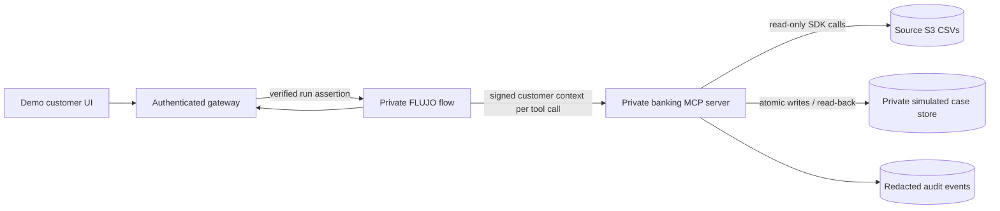

# Banking MCP over the source S3 dataset

> **Historical design:** the MCP is now implemented as stdio inside the existing
> FLUJO worker. See [implemented state](BANKING_MCP_IMPLEMENTATION.md) and
> [the coordinated next plan](BANKING_MCP_NEXT_STEPS.md) for current serving and
> integration decisions. Statements below that no MCP exists or that banking-specific
> ingress is the target are superseded.

**Plan date:** 2026-09-27; revised after the second FLUJO review. **Status:** design only; no banking MCP, customer-bound FLUJO integration, case store, or banking flow exists in this repository. Data ingestion and snapshot lookup are implemented in [pipeline/](../pipeline/README.md). This plan refines the [hackathon delivery plan](HACKATHON_AUDIT_PLAN.md) for the requested **direct S3** access path. The [data review](DATA_REVIEW_2026-09-26.md) is the evidence base. The [FLUJO banking run design](FLUJO_BANKING_RUN_AUTH.md) and [review record](FLUJO_BANKING_RUN_AUTH_REVIEW.md) specify customer identity, executed evidence and the 500-user release gate.

## Decision

Build a small **banking MCP server** that reads the organizer's source S3 CSV objects with the AWS SDK on each customer transaction inquiry. Expose only customer-scoped banking operations to its MCP client. The server, not the model, chooses S3 keys, parses rows, checks ownership, masks fields, and applies policy. The dataset remains read-only. A separate private case store holds simulated intake and handoff records.

Use the separate frontend's server to authenticate each demo customer, then run one shared graphical FLUJO flow with a verified runtime principal. FLUJO calls the banking MCP directly and attaches a signed, per-call customer assertion outside model text; the bank server verifies it independently. This requires the narrow FLUJO enhancement and security gates in the [run design](FLUJO_BANKING_RUN_AUTH.md). The inspected FLUJO checkout is still `15d019f7` and has unrelated local changes; its documented local `/v1` endpoint is not end-user authentication, and configured MCP headers alone do not establish per-run identity. If the direct FLUJO security gate fails, the frontend server can call the banking MCP itself while FLUJO handles language and orchestration.

### Review of current evidence

| Area | Verified state | Consequence for this plan |
| --- | --- | --- |
| Repository | Reviewed at `5787cc6`, including the team's DuckDB bronze/silver/gold pipeline, ownership-filtered lookup and aggregate quality report. Gold is a local snapshot read model; its sequential benchmark is not a live S3 or 500-user test. | Reuse ingestion/owner validation for the source index, or explicitly choose snapshot serving. Banking identity, MCP, case persistence and evaluation remain to build. |
| S3 scan | 13 families, 7,671 objects, ~5.35 GB inventoried; six families fully row-profiled. | Restrict this workflow to the audited customer, product, and transaction families. |
| Transaction ownership | 4,425,008 rows; no observed missing customer/product or owner mismatch. | Runtime owner checks remain mandatory for every returned row. |
| Historical complaints | 12,297 unrecognized-charge complaints out of 67,095; all origin-interaction IDs empty and all 44,570 populated product links point to another customer. | Use complaints for demand counts only; never authorize or enrich a case from these links. |
| Language data | 171,321 transcripts but only 42 distinct exact customer utterances, all tagged Spanish; five exact complaint descriptions. | Create human-reviewed Spanish and Portuguese evaluation cases rather than train on this text. |
| Temporal quality | 9,316 customer and 25,113 product updates postdate the stated cutoff. | Label master data as supplied snapshots; ground inquiry facts in dated transaction rows. |

### Why this access pattern

The scanned source has single CSVs for `customers` (~47 MB) and `products` (~68 MB), and **1,097 daily transaction CSVs totaling ~808 MB**. The audit found 4,425,008 transactions with no observed customer/product owner mismatch, but that does not replace a runtime check. The source is partitioned by process date, **not customer or transaction ID**. An unrestricted `get_transaction(id)` would require a broad scan; S3 range reads cannot find a CSV record by ID without a separate byte-offset index. A direct, bounded date query is the first contract. For the 500-concurrent-customer target, build the private customer-to-date index described in the [FLUJO run design](FLUJO_BANKING_RUN_AUTH.md) before claiming production-like latency, while still retrieving authoritative transaction rows from source S3.

## Source access and query contract

1. At startup, use an allowlisted source bucket and exact `data/customers.csv`, `data/products.csv`, and `data/transactions/year=YYYY/month=MM/day=DD/...` key pattern. Discover transaction keys with `ListObjectsV2` only under `data/transactions/`; never accept a bucket, prefix, key, URL, or S3 operation from tool arguments. Record key, size, ETag, and last-modified in a private manifest. Verify actual CSV headers and required types before serving traffic.
2. Stream `customers.csv` and `products.csv` once per process to build **minimal in-memory maps**: known customer IDs and `product_id -> customer_id` (plus only any display field needed and approved). Do not place raw customer records in model context or on disk. A restart or explicit manifest refresh reloads them. If either object changes during a session or a map cannot be loaded, fail closed.
3. `list_my_transactions(start_date, end_date, limit, cursor)` accepts an explicit historical **process-date** interval of at most 31 days within the observed 2023-06-17 to 2026-06-17 partitions, with `limit <= 20`. The default is the latest 31 source days, **not the current calendar month**. Set initial caps of 31 S3 objects and 64 MiB of source bytes per request, plus a small concurrency limit, timeout, and response-size bound; reject a window whose manifest exceeds either cap before fetching rows. Tune these limits from measured object sizes. Stream each allowed daily CSV through `GetObject`, validate the header, and filter rows server-side before sorting/paging. Bind any cursor to the same principal, session, date range, and pinned manifest. More lookback requires another bounded request or an indexed access path. Repeated scans may be expensive; measure them before broadening the window.
4. A result includes only transaction reference, date, amount, currency, status, merchant label if appropriate, masked product descriptor, source-as-of label, and an opaque **selection handle**. The handle is short-lived and bound server-side to the authenticated customer, transaction ID, process-date key, object ETag/version if available, and session. `get_my_transaction(selection_handle)` re-reads the **one** source day, locates the row, and repeats all checks. A guessed transaction ID never becomes a global lookup.
5. For every returned or actionable row, require `transaction.customer_id == verified_session.customer_id`, a known `transaction.product_id`, and `products[transaction.product_id].customer_id == verified_session.customer_id`. Reject conflicting or duplicate IDs, malformed amounts/dates, changed source objects, and unknown owner links. Never join `complaints.affected_product_id`; all 44,570 populated links failed owner equality in the full audit. Exclude `is_fraud`, `fraud_score`, coordinates, document numbers, full product numbers, balances, and historical outcomes from ordinary tool responses.
6. Pin an immutable manifest for a running session, including source inventory and the owner-map/index versions. If bucket versioning and permission are available, record and request exact `VersionId` values. Otherwise require organizer-enforced immutability or inventory invalidation with atomic index rebuild, and use conditional `GetObject` against recorded ETags. `If-Match` only detects changes in fetched objects: a new row in a date omitted by a stale customer index is invisible. Do not report empty history from an index whose completeness is unverified. An ETag is a change validator here, **not** a cryptographic file hash. Record source key/version privately and expose a harmless snapshot/source reference to the assistant.

The `transaction_date` and `process_date` fields have different meanings: use the source partition's process date to locate a file, but display the transaction timestamp after validating it. The audit checked partition/date consistency and missing amounts, not all business semantics. Master `last_updated` values can exceed the stated cutoff, so display master attributes only as **supplied snapshot values**; do not claim an as-of-June balance or product status.

## MCP tools and action boundary

| Tool | Inputs controlled by caller | Server-enforced result / action |
| --- | --- | --- |
| `session_context` | None | Minimal session state and expiry from verified transport identity; no customer ID supplied by the model. |
| `list_my_transactions` | Bounded dates, limit, opaque cursor | Customer-owned, masked rows only; fixed schema and count/byte limits. |
| `get_my_transaction` | Opaque selection handle | One verified row, or a generic unavailable/unauthorized outcome. |
| `get_dispute_policy` | Version or none | Versioned **synthetic** intake policy, not a claim of bank policy. |
| `create_dispute_intake` | Selection handle, reason code, confirmation reference | Rechecks identity, source row and policy; creates one simulated case, then read-back verifies receipt. |
| `get_my_case` | Case handle | Customer-owned receipt/status from the separate case store. |
| `create_handoff` | Case/context handle, reason code | Minimal verified facts and unresolved questions in a private operator queue. |

Customer confirmation is an authenticated gateway/UI event bound to the subject, conversation, selected transaction/source version and exact action digest, with expiry. The bank derives the payload from that server-held consent; a deterministic Static action path submits its reference. Atomically consume consent and write the case/receipt under a unique logical-operation identity, rejecting changed payloads. Separate this identity from the assertion's per-attempt `jti`. For the single-instance demo, use private persistent SQLite on an encrypted volume; multiple bank instances need shared transactional storage. On an uncertain write, freshly authorize receipt lookup before retrying. The assistant says “intake created” only after receipt read-back, and the UI displays the verified record. Pending/declined/reversed, suspected fraud, mismatched data, policy exceptions and unavailable tools follow the synthetic handoff/abstention policy. No real chargeback, card block, refund or payment movement is permitted.

## Identity, AWS, and data protection

- **Customer identity:** The frontend server authenticates a seeded test user and sends a short-lived assertion to FLUJO. FLUJO binds each conversation to that verified subject and signs per-call customer context for the banking MCP; the bank server maps the subject to a dataset `customer_id` privately and checks it against every row. The mapping never comes from prompt text or tool arguments. The bank MCP validates both its HTTP service credential and the per-call assertion. FLUJO workspace partitions and shared static MCP headers are not customer isolation. The [run design](FLUJO_BANKING_RUN_AUTH.md) details the binding and fail-closed tests.
- **S3 identity:** Only the banking server holds AWS permissions. Prefer workload-role temporary credentials for deployment; the existing local `S3credentials.env` is for private development/profiling and must never be shipped to browser, FLUJO prompts, or public repo. Ask the dataset owner for a role or scoped temporary credentials. Scope `s3:ListBucket` to required prefixes and `s3:GetObject` to the three source families; add `s3:GetObjectVersion` for version-pinned reads, which may require the source owner's permission. Deny writes in this role. If objects use SSE-KMS, arrange only the required decrypt permission. S3 IAM protects the dataset at the application boundary; because many customers share an object, **per-customer authorization is enforced in the server code**, not by S3 object permissions.
- **Network and secrets:** Keep MCP and case store private; expose only the authenticated gateway over HTTPS. Use managed secrets or runtime identity, TLS to S3, encrypted private case storage, tight log access and retention, and no raw source CSV persistence. Do not return S3 URLs or presigned URLs. Avoid logging tokens, source rows, customer text, document/product numbers, or AWS request headers.
- **Untrusted content:** Treat merchant names and any source free text as data. Escape or structure it before sending to FLUJO, cap lengths, and test prompt-injection attempts. MCP errors must not reveal whether another customer's ID exists.
- **Audit:** Log an event ID, pseudonymous principal reference, tool name, decision, policy version, source version/ETag reference, case/receipt reference, and timing. Make sensitive lookup and write attempts traceable without storing source rows in application logs.

AWS recommends temporary workload credentials and least privilege; its S3 docs describe prefix-restricted listing, version permissions and conditional/ranged reads. MCP authorization is optional at protocol level; deployments implementing its OAuth profile must validate audience-specific tokens and support its discovery requirements. Our fixed service credential plus signed delegation is a custom internal profile, not demonstrated OAuth conformance. See [IAM best practices](https://docs.aws.amazon.com/IAM/latest/UserGuide/best-practices.html), [S3 policy keys](https://docs.aws.amazon.com/AmazonS3/latest/userguide/amazon-s3-policy-keys.html), [GetObject](https://docs.aws.amazon.com/AmazonS3/latest/API/API_GetObject.html), and the [MCP authorization specification](https://modelcontextprotocol.io/specification/2025-11-25/basic/authorization). Pin SDK versions and protocol revision at implementation.

## Delivery gates and proof

| Gate | Concrete output | Pass condition |
| --- | --- | --- |
| 1. Source contract | Key allowlist, CSV schema checks, manifest, minimal owner maps | Read-only direct S3 startup works; changed/missing source fails closed. |
| 2. Identity and read tools | Frontend-to-FLUJO-to-MCP principal binding, bounded date scans, handles | Two concurrent users cannot see or select each other's rows; forged IDs/handles, expired sessions, and oversized windows are denied. |
| 3. Action path | Synthetic policy, durable case store, idempotency, read-back | Confirmation is tied to the selected owned transaction; retries return one receipt; no receipt is claimed before verification. |
| 4. FLUJO integration | Shared graphical flow with verified `TrustedRunContext` and signed per-call banking context | Context survives every enabled adapter, Static, approval and synchronous subflow path. Untested paths are denied. Credentials absent from model/debug/SSE/logs; ownership holds across interleaved runs. |
| 5. Evaluation | Frozen Spanish/Portuguese cases and redacted traces | Measure safe inquiry/intake, handoff errors, leakage/action attempts, p50/p95 latency, S3 GETs/bytes, and cost on the same cases as the rule baseline. |

For the October 5 submission, prioritize gates 1–4 before polish. A practical first smoke test uses two seeded customers with known transactions on different dates, one cross-customer selection attempt, one expired session, one changed-object simulation, and an uncertain-write retry. The broader held-out set in the hackathon plan remains the evaluation target. Build an encrypted private customer-to-date index from S3 for the 500-customer load gate and use it only to narrow candidate **source objects**; keep the ownership recheck and authoritative `GetObject` read. Do not claim the 500-customer target until the indexed path passes the measured load test, and do not silently replace direct source reads with an untracked cached copy.

## Open decisions for the team

1. Dataset owner: grant a scoped deploy identity or temporary credentials; confirm hosting region, versioning/version-read permission, immutable snapshot or invalidation contract, encryption and retention. The present read-only key does not authorize case writes or an index in the source bucket.
2. Banking policy owner: approve a clearly synthetic eligibility and handoff table, including treatment of statuses and suspected fraud. The dataset does not provide an authoritative dispute policy.
3. Deployment owner: choose the private case database and frontend identity provider/test-user mapping; prove per-request FLUJO identity propagation before enabling FLUJO-to-MCP banking calls.

These decisions affect deployment and claims, but the read-only source adapter and authorization tests can be built first.
