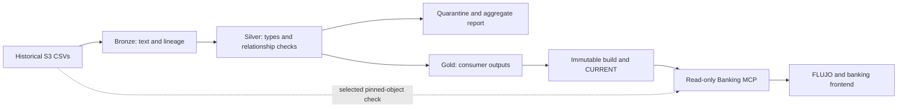

# Data recovery review and local runbook

Reviewed September 29, 2026. This document is the handover for the data workstream.
It distinguishes source facts, implemented behavior, and proposed workflow contracts.

## Decision in plain language

Keep Carlos's pipeline and recover its operation. The architecture is appropriate for
this hackathon; replacing it with a distributed data platform would add work without
solving the observed data defects.

Treat the organizer's S3 data as a historical migration/demo source. S3 is the original
read-only source of record. The app reads a derived local snapshot, which can be rebuilt.
The organizer's records are synthetic banking fixtures; they are not a live bank feed.
The transaction period ends June 17, 2026. Some customer/product updates fall later, so
master-table balances and statuses are supplied snapshot values, not historical balances.

DuckDB is the SQL engine doing the transformations on the laptop. Parquet is the file
format storing their results. Neither requires a database server. The layer names mean:

| Layer | What it contains | What it means for the team |
| --- | --- | --- |
| Bronze | Selected CSV values represented as text in Parquet, plus source lineage | A local landing area for repeatable processing; not a byte-for-byte CSV archive |
| Silver | Typed, deduplicated records; rejected rows separated; relationship flags | Records that passed explicit technical rules, with known defects still visible |
| Gold | Customer-sharded transactions, demand aggregates, ML diagnostics, demo candidates | Outputs prepared for a specific consumer; the word does not guarantee business truth |
| Quarantine | Rejected typed rows and reasons | Evidence of errors to investigate, not silently discarded records |



## What was recovered from Git

| Evidence | Implemented result |
| --- | --- |
| Carlos's [PR #1](https://github.com/mario-andreschak/factored-hackathon-2026-mcg/pull/1), commit `35b34d9` | DuckDB stages, contracts, reports, gold outputs and synthetic tests |
| Carlos's [PR #2](https://github.com/mario-andreschak/factored-hackathon-2026-mcg/pull/2), `0ff3a05` | Per-call cursors, atomic snapshot pointer, publish-safe reports, known-customer check |
| [PR #3](https://github.com/mario-andreschak/factored-hackathon-2026-mcg/pull/3) / [#4](https://github.com/mario-andreschak/factored-hackathon-2026-mcg/pull/4) | Intent-router baseline and tracked authored evaluation data |
| Merged [PR #5](https://github.com/mario-andreschak/factored-hackathon-2026-mcg/pull/5) | Customer-bound read-only MCP installed as stdio inside the existing FLUJO worker |
| Open [PR #6](https://github.com/mario-andreschak/factored-hackathon-2026-mcg/pull/6), reviewed at `c526014` | Operator demo, snapshot file inventory, source ingestion checks, retained builds, runtime and evaluation evidence |
| Main `b5d0ef2` / `031db90`; open [PR #7](https://github.com/mario-andreschak/factored-hackathon-2026-mcg/pull/7) | Proposed graph/contracts/policies and YAML prompts; these do not implement the named graph nodes or banking write tools |

The primary local checkout was at `6c6cef7`, behind the MCP work. Recovery uses
`codex/data-recovery`, based on PR #6 in an isolated checkout. Newer main proposals
were reviewed separately; this recovery PR changes the data workflow.
The older direct-S3 plans are historical. For runtime behavior, use
[the MCP implementation](BANKING_MCP_IMPLEMENTATION.md) and
[banking_mcp/README.md](../banking_mcp/README.md).

## Source coverage and usable data

The live metadata review found **13 families, 7,671 CSV objects and 5,349,322,481 bytes**.
Every recorded object in the six-table source inventory matched today's S3 key, ETag,
size and last-modified value: zero added, deleted or changed objects. This proves metadata
agreement at the time checked, not the provenance of an inherited local file.

The pipeline supports six families, **4,390 objects and 1,218,405,862 source bytes**:

| Family | Full historical row count | Safe intended use |
| --- | ---: | --- |
| Customers | 150,000 | Customer existence and non-identifying demo attributes |
| Products | 400,000 | Customer-owned products and supplied snapshot balances/currencies |
| Transactions | 4,425,008 | Dated, customer-owned charge lookup |
| Call center interactions | 686,296 | Aggregate contact demand |
| Call transcripts | 171,321 | Template/leakage diagnostics, not credible language evaluation |
| Complaints | 67,095 | Aggregate complaint demand; exclude defective product links from customer views |
| **Total** | **5,899,720** | Six contracted families |

Branches, service agents, daily exchange rates, marketing campaigns, campaign sends,
satisfaction surveys and digital events were structurally inventoried. They have no
pipeline contracts or gold outputs in this implementation. The remaining seven families
contain about 4.13 GB; digital events alone contain 3.76 GB. Do not describe those rows as
cleaned or fully profiled. Add a consumer, contract and tests before extending ingestion.

## Data defects and explicit handling

| Finding | Required handling |
| --- | --- |
| All 44,570 populated complaint product links reference another customer's product | Preserve and flag the source defect; never join them into a customer product view or authorize access with them |
| All 67,095 complaint origin-interaction IDs are empty; no complaint transaction-ID column exists | Do not present historical complaint-to-call or complaint-to-charge matches as verified |
| 76.7% of transactions have no merchant name | Identify charges using date, amount, type and channel; use a neutral fallback in the UI |
| Country spelling varies (`México` / `Mexico`) | Report spelling drift; presentation may normalize labels without changing source identity or ownership |
| Master updates can exceed the advertised cutoff | Label balances/statuses as supplied snapshot values; do not reconstruct a historical balance from incomplete rules |
| Source transaction currency includes USD for Mexico | Preserve each product's actual currency; do not infer MXN from customer country or sum mixed currencies |
| Only 42 distinct transcript texts, with every test text also seen in training | Use independently authored ES/PT test cases, with human label review pending; do not claim production-quality ML accuracy |
| No natural near-duplicate-charge case was found | Label any injected duplicate scenario synthetic |

The source ownership chain for all 4,425,008 transactions is intact. Silver flags
relationship errors, and gold/MCP restrict reads to known customers whose products
belong to that same customer. These guarantees make the supported lookup suitable for
the demo. They do not make every field, complaint relationship, or ML label trustworthy.
The current rejection threshold is 5% per table; a successful build can still contain
quarantined rows and flagged relationships. Read the quality report before using it.

## Recovery fixes

The review reproduced two publication bugs using synthetic data: bronze+gold without
silver could report fresh ingestion while serving prior silver; a customers-only run
could replace `CURRENT` with a build containing no banking gold files. Recovery now:

- Validates stages, supported table names and parent dependencies before touching data.
- Requires the customer/product/transaction trio for gold publication into this banking root.
- Copies only requested silver tables for gold-only regeneration and scopes lineage to them.
- Reads input statistics from the landing/build itself instead of an unrelated mutable docs report.
- Pins the aggregate `manifest.json` inside each published build before swapping `CURRENT`.
- Allows silver/gold regeneration without an S3 credentials file.
- Provides `scripts/check_dataset.py` for aggregate health, ownership and optional live metadata checks.
- Uses structured row hashing, so embedded delimiters or a literal null marker cannot conceal conflicting versions.
- Pins the tested DuckDB version and records transformation code digest/runtime versions in aggregate build metadata.
- Holds an exclusive writer lock for the entire run, including landing, publication and reports.
- Keeps per-query DuckDB spill files beneath the private data root rather than the current working directory.

Source ingestion checks selected inventory before and after the read. It assumes the
source stays static during ingestion; it does not pin S3 VersionIds. Old builds remain
available for readers. Parquet inventory currently checks paths and byte sizes, not
cryptographic protection against same-size tampering; filesystem access must remain private.

## Local commands

From the recovery checkout, the virtual environment is installed in `.venv`:

```powershell
python -m venv .venv
.\.venv\Scripts\python.exe -m pip install -r requirements-mcp.txt -r requirements-ml.txt
.\.venv\Scripts\python.exe -m pipeline run --env C:\private\S3credentials.env --out data --reports data\recovery-reports --threads 4 --memory-limit 4GB
.\.venv\Scripts\python.exe -m pipeline run --stage silver gold --out data --reports data\recovery-reports --threads 4 --memory-limit 4GB
.\.venv\Scripts\python.exe scripts\check_dataset.py --out data --env C:\private\S3credentials.env --report data\dataset-health.json
.\.venv\Scripts\python.exe -m pytest -q tests scripts\banking_acceptance_load_test.py
```

Use the team's existing private credentials path; the example is a placeholder. A full
run reads S3; silver+gold reruns use the validated local landing. No credentials or raw
rows belong in Git. The source inventory and snapshots contain private source details;
only aggregate recovery evidence is published under `docs/data-recovery/`.

Allow room for the landed and derived snapshots plus transient spill space. The measured
full transaction health join at a 1 GB memory limit needed about 2 GB of temporary disk.
Normal connection close removes spill files; an interrupted query can leave private
`.duckdb-spill/` leftovers. Remove those only after the relevant queries have stopped.

The [live inventory review](data-recovery/source_inventory_audit.json) and
[all-family structural review](data-recovery/structural_dataset_review.json) retain
the exact audit scope and denominators. Header agreement alone is not a row-quality test.

`data/CURRENT` selects `data/builds/<id>`. That directory holds silver, gold, quarantine,
`source_objects.json`, `snapshot.json`, and the pinned aggregate `manifest.json`. The MCP
needs the **complete data root**, not just the gold directory. Keep existing readers on
their complete old build until the staged replacement is validated. A `CURRENT` swap
invalidates old selection handles/cursors; start a fresh conversation after a data change.
Competing writers fail at `data/.pipeline-writer.lock` before touching the landing.
If a process crashes, confirm that it stopped before manually removing the stale lock.
Future raw `data_s3/` extracts and operational `sandbox/` files are also excluded from Git.

## Frontend and MCP integration boundaries

The frontend and MCP chats were coordinated directly; the MCP chat coordinates the
FLUJO runtime owner. The fresh build keeps existing types, 128 customer buckets, source
lineage, and the schema expected by `banking_mcp/repository.py`.

Actual MCP behavior is read-only, with `banking_status`, `list_my_transactions` and
`get_my_transaction`. It supports up to **31 inclusive process dates**, defaulting to the
latest dates in the historical snapshot. It does not submit a complaint, refund money,
run an FX conversion service, or expose fraud scores. A local FLUJO handoff ticket is a
prototype receipt, not a bank action.

Newer `contracts/`, `graph_config_v3.yaml`, and `resources/` describe broader proposed
behavior, including 90-day current-calendar searches and complaint writes. Their graph
node names and write contracts are not implemented by the shipped MCP. Resolve this
contract difference in the application layer before presenting those functions in the UI.
The proposed complaint product matching rule cannot establish a verified charge link
using the defective historical complaint product field.

Normal reads use gold. MCP `verify_source:true` conditionally checks pinned master
ETags and reads the selected source object with `If-Match` and an 8 MiB cap. Its result
means that selected row still agrees with those pinned objects. It does not discover all
new late-arriving partitions or establish live banking freshness. The separate
`pipeline.verify` seven-day search is an offline diagnostic and has different semantics.

For malformed values, quarantine contains the typed row and reason; use its source
lineage to inspect bronze for the original malformed text. The offline verifier can
return values that the silver contracts would reject and must not authorize a write.

## Ongoing ownership and remaining decisions

For a data change: rerun ingestion, inspect aggregate health/quality, stage the complete
build, then coordinate the mount/pointer change with MCP and frontend. For an app change:
use owner-scoped tools; do not add generic S3 access to customer-facing flows. Existing
builds can be removed only with their readers stopped.

The remaining product decisions are human review of the ES/PT labels, a real complaint
write backend if required by the demo, and whether any of the other seven data families
has a concrete consumer. None requires replacing the recovered pipeline. Historical
capacity results and model latency belong to their exact runtime evidence; the data
lookup benchmark is a different measurement.

The local recovery build and verification results are recorded below once completed.
