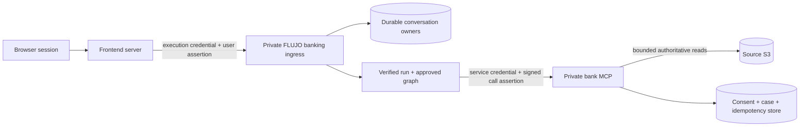

# Customer-bound banking runs in FLUJO

**Revised after the second review, 2026-09-27. Status: implementation proposal.** FLUJO remains the workflow backend and banking MCP client. Use shared graphical flows, an authenticated frontend server, an immutable principal for each run, and independently enforced ownership in the banking MCP. The [review record](FLUJO_BANKING_RUN_AUTH_REVIEW.md) separates source findings, executed probes, alternatives and implementation gates. This review does not implement banking authorization.

## 1. Decision and scope

**Hackathon default:** retain FLUJO's default MCP SDK v1 path. Add a bank-specific signed assertion to `tools/call.params._meta` in trusted server code after argument normalization. A fixed service credential authenticates the private HTTP connection. The bank verifies both credentials and every requested object's owner. Customer identity never comes from model arguments, caller-authored metadata, URLs or workspace names.

**Credible alternative:** the installed SDK v2 supports custom per-request HTTP headers on a shared Streamable HTTP client. A synthetic probe verified `X-Flujo-Bank-Assertion` without connection mutation. Those options cannot override `Authorization`; v1 ignores them. Choose this carrier if a bank-specific v2 factory is added and verified. Avoid changing the workspace-wide experimental switch merely for banking. Both carriers require the same authorization envelope and tests. Pin exact SDK versions and protocol revision in implementation.

Use a dedicated FLUJO banking deployment and one fixed workspace. Reuse an approved inquiry graph across customers. An optional second **shared Static-only action graph** can handle confirmed case creation; neither graph is copied per customer. Preserve the editor, adapters, context, retries and aggregate statistics while restricting banking execution.

**Threat model:** defend against authenticated customers selecting foreign IDs/URLs, forged browser metadata, prompt injection, malicious source text, concurrency, expiry, retries and restart/resume. Frontend server, vetted graph authors, FLUJO runtime/signing code, bank MCP, identity mapping and private stores are trusted. Compromise of their code/signing keys is outside the customer-isolation claim. Non-enumerable state prevents accidental serialization; it is not a sandbox against arbitrary JavaScript, shell or file access.

## 2. Evidence from current code

Reviewed FLUJO source at `15d019f7b952b2f2d3aea1197722ac8d9f520d7c`, preserving unrelated working changes. Installed SDKs: `@modelcontextprotocol/sdk` **1.30.0**, `@modelcontextprotocol/client` **2.0.0**. The source calls its switch `mcpBetaProtocol`; that name does not establish the installed package's release status.

- Generic `/v1` accepts caller routing/debug/context fields. Its ordinary local bearer is not customer authentication. Worker mode has a central **service** bearer gate in `src/proxy.ts`; adapt it with a separate banking execution credential, keeping snapshot/admin authority separate.
- `runFlow` installs `executionAuthority` non-enumerably, clears stale authority on invocation and strips it from persistence. Persona execution authority is not banking identity, but this is a useful pattern.
- ModelHandler, Claude/Codex adapters, Static nodes, tool tester, Apps and proxy tool calls reach `MCPService.callTool`. All need explicit context or denial. `resumeAfterApproval.ts` invokes tool processing without conversation/run/authority context and needs a specific change.
- `tools.ts` constructs host-owned request `_meta`. SDK/server probes passed 500 interleaved synthetic calls per metadata carrier, verifying serialization/correlation rather than full FLUJO authorization.
- `@conversation.id` works in dynamic references/presets; fixed presets override model values. Explicit references can select another conversation. Static templates resolve run variables/resources, not that preset path: the live Static fixture left `@conversation.id` literal. Runtime context must supply identity in every node.
- **Elicitation currently has a shared-run hazard:** `elicitationContext.ts` keeps one context per workspace/server. B overwrites A; A's cleanup can erase B. The handler uses that context to route a server prompt to a conversation. Disable banking elicitation until routing uses the authenticated originating request.
- Task poll/result/cancel and resource/prompt reads have separate paths. A tool-only guard is insufficient if they carry customer data. Bank MVP exposes synchronous tools with static customer-independent schemas.
- Conversation locks, active state, event channels and control registries are process-local. ModelHandler's concurrency caps apply to a batch, not all 500 runs. Warm-client and terminal-cache limits do not cap active work.

## 3. Trust path and ingress

1. Frontend authenticates its browser session, derives subject/scope from trusted policy, and issues a short-lived assertion for the **FLUJO banking ingress audience**. Do not pass a browser-claimed subject or unchecked identity-provider token to the bank.
2. Add exact banking chat/read/events/cancel/confirmation routes, protected with a dedicated execution credential or mTLS plus the user assertion. Adapt worker admission so this credential grants only those routes; retain separate snapshot/admin credentials. Host/Origin checks and private networking are not authentication.
3. Accept a bounded new **user** message and optional existing conversation ID. Reconstruct history from owned server state. Reject/ignore caller `model`, `flujo`, workspace query/header, `processNodeId`, graph/snapshot, Persona target, debug, tools/results, app context, skills, system/assistant roles and arbitrary metadata. Server selects the pinned approved graph/provider policy and forces workspace **before** workspace/state lookup.
4. Generate conversation UUIDs on the server. Atomically insert `(deployment, workspace, conversation_id) -> (issuer, subject, graph_revision)` in a durable owner registry before use. A supplied unknown ID is not a creation request. Do not adopt legacy/unbound conversations. Owners are immutable; deletion tombstones prevent resurrection/rebinding.
5. On every turn/read/event replay/cancel/confirmation/approval/resume, verify fresh identity and owner **before** state load or registry side effects. Foreign and unknown IDs get the same unavailable response. Include child conversations, resources/media, archives, list/search and recovery if exposed. Keep global firehose and generic control/debug routes inaccessible to customers.
6. SSE uses owned channels, disables shared/proxy caching, and closes on expiry/revocation. Re-authenticate reconnect/replay. Keep credentials out of URLs.

These checks follow [OWASP authorization guidance](https://cheatsheetseries.owasp.org/cheatsheets/Authorization_Cheat_Sheet.html). MCP's [security guidance](https://modelcontextprotocol.io/docs/2025-11-25/tutorials/security/security_best_practices) also treats session IDs as state, not authentication.

## 4. Runtime context and dispatch

Create an immutable server-only `TrustedRunContext` after verification/owner admission, with provenance from a private factory/registry. A matching TypeScript shape alone proves nothing. Include `(issuer, subject)`, session/revocation reference, workspace, root/current conversation, logical run ID, graph revision, allowed operations, expiry and `assertCurrent()`. Bind logical run ID when `runFlow` creates/resumes it; conversation and run IDs are different.

Pass context explicitly through `FlowRunInput`, nodes, handlers and adapter options. A non-enumerable SharedState handle may ease integration; explicitly strip it from snapshots, debug/error/trace/model projections. Replace/clear it per invocation. Never recover authority solely from a caller-selected conversation ID. Approval paths install fresh context **before** executing a tool or resolving a live registry.

**Dispatch sequence:**

1. Resolve the destination from immutable server policy; deny missing/expired/unrecognized context before connecting. A protected config flag is useful, but the bank independently rejects unasserted calls even through aliases or a missing flag.
2. Apply approved presets and argument normalization, then validate the strict bank schema. Reserve identity/auth fields and discard caller-supplied assertions. Signing keys/credentials never enter FLUJO's global variable interpolation store.
3. Recheck session, owner, graph/tool and scope immediately before dispatch. Sign a short-lived **bank-MCP-audience** assertion bound to tool and a digest of finalized normalized business arguments. Use maintained JOSE/canonicalization libraries with a fixed profile.
4. Inject a namespaced `_meta` key such as `com.flujo.bank/assertion`, or the approved custom per-request header. Never swap shared headers/tokens/env vars/current-customer state. Never reuse the frontend assertion as the bank assertion.
5. Bank verifies the assertion and privately maps `(issuer, subject)` to dataset customer. Check customer/product/transaction/handle/cursor/receipt ownership and source versions. S3 keys/buckets/URLs and dataset customer IDs are not model parameters.
6. Recheck context after long calls and before releasing results or further persistence. Expiry/revocation blocks further disclosure/actions, but does not undo a committed write; reconcile its receipt.

Token profile: separate frontend/bank types, audiences and keys; fixed allowlisted algorithm and trusted issuer/key IDs; required subject/iat/nbf/exp/jti, bounded TTL/skew/size, session reference, logical call ID, root/current conversation/run, graph/tool/scope and arguments digest. Reject unsigned/wrong-type/wrong-audience/unknown-key tokens. Do not follow token-supplied `jku`/`x5u` URLs. Require authoritative session/revocation validation before signing rather than relying solely on TTL. Bound key-rotation overlap to token lifetime. See [JWT best current practices](https://www.rfc-editor.org/rfc/rfc8725.html).

### Bank protocol and graph restrictions

Use Streamable HTTP, synchronous tools and static schemas. Disable bank Apps, elicitation, sampling, customer resources/prompts/skills, tasks, subscriptions and detached bank subflows. Reject unsolicited task/input-required results explicitly; a disabled client flag alone is insufficient. Shared MCP session represents the FLUJO service. Bank must have no session current-user state, customer-bearing global notifications or unscoped result cache.

Only vetted synchronous subflows may inherit narrowed context. Bind child ownership to the same subject/root before access; a model session key cannot establish ownership. Keep bank calls top-level until inheritance passes its tests.

Reject graph features sharing customer facts across runs: `${kv:...}`, `captureKv`, generic conversation/resource/file/shell tools, unsafe filesystem attachments and broad memory/retrieval. Shared policy text is fine; persisted customer facts need owner namespaces/checks. Validate the graph/subflow closure at publication and execution. Non-enumerability cannot protect an exposed shell/file tool.

## 5. Consent, retry and write contract

Verified identity establishes eligibility, not consent for every write. Frontend displays the owned transaction and exact simulated action. Its authenticated backend registers consent bound to subject, conversation, transaction/source version, action digest and policy version, with expiry. Model/browser cannot change what that reference authorizes. This follows [OWASP transaction authorization](https://cheatsheetseries.owasp.org/cheatsheets/Transaction_Authorization_Cheat_Sheet.html).

A deterministic Static action path consumes consent. Bank derives payload/idempotency identity from that consent/logical operation, rechecks ownership, and atomically commits consumption + one case/receipt. Concurrent confirmations/retries create at most one case. Receipt lookup checks owner. Generic FLUJO approval may supplement this contract but cannot replace it.

Separate **logical operation ID** from **assertion jti/transport attempt**. Replay cannot execute a different operation or changed arguments. Freshly authorized retry of the same operation returns its receipt; conflicting payload is denied. Deny replayed execution and reconcile ambiguous failures through a scoped status/read-back path. Test SDK auth/reconnect behavior; do not weaken replay checks to make retries succeed. Claim success only after receipt read-back.

A fixed service bearer is a custom internal profile, **not proof of MCP OAuth conformance**. [MCP authorization](https://modelcontextprotocol.io/specification/2025-11-25/basic/authorization) is optional at protocol level and specifies OAuth/discovery/token validation when supported. Our service credential + signed delegation is a closed deployment design. For interoperable OAuth later, evaluate [RFC 8693 token exchange](https://www.rfc-editor.org/rfc/rfc8693.html); do not pass through tokens intended for another service.

## 6. Alternatives

| Alternative | Conditions and assessment |
| --- | --- |
| Signed `_meta` on shared v1 client | Default: runtime injection, signature/args/owner checks and restricted protocol. Carrier demonstrated. |
| Signed custom header on shared v2 client | Same checks, bank-specific factory. Demonstrated under legacy negotiation; avoids credential in MCP body. Modern negotiation/SSE retries remain to test. Per-request Authorization override is blocked. |
| Opaque random capability in `_meta`/header | Unguessable server-issued value and private registry binding owner/run/scope/expiry; atomic revocation. Sound alternative to JWT, with a shared lookup per call. |
| Per-customer immutable client/config | Can be secure with authenticated subject/credential pool keys and bounded lifecycle. More connections/token state; still needs conversation/result checks. Avoid persisted reconfiguration races. |
| Owner registry + `@conversation.id` | Useful correlation if runtime overwrites ID. Bank still requires trusted signed/opaque delegation; ID + service key alone is insufficient. |
| Template copy / workspace per customer | Useful customization/process isolation when credentials/resources are also isolated. Duplication alone proves no ownership; unnecessary for 500 users. |
| User OAuth token exchange | Standards-based evolution with real authorization server, correct audience/scopes and request-safe transport. Greater infrastructure cost. |
| Frontend calls MCP; FLUJO uses bounded facts | Fallback only if direct FLUJO banking gates cannot pass; frontend still uses FLUJO orchestration. Must be tested before deployment. |

## 7. S3 and 500 concurrent customers

Audit: 1,097 transaction CSVs, 808,333,639 bytes. Five hundred full 31-day scans imply **15,500 GETs and ~11.4 GB** at average file size. This is an estimate, not a benchmark. The 150,000-customer/4.43-million-transaction average suggests a sparse date index helps, but measure skew/hot dates.

The current repo now has `pipeline/gold.py` and `pipeline/lookup.py`: customer-sharded Parquet and a local sequential benchmark. Reuse ownership validation/ingestion where useful. This is a **snapshot read model**, not direct source access or 500-user evidence. Gold omits per-row source-file lineage; aggregate manifest does not pin every object's VersionId/ETag.

For direct-source access, build a private customer-to-source-date/file index from bronze/silver lineage with an immutable source manifest. Fetch authoritative S3 rows and recheck owners. Prefer version-pinned snapshots, `GetObjectVersion` permission and a snapshot label. With unversioned objects, `If-Match` detects changes only in files fetched: it cannot detect new rows in an excluded date. Require organizer-enforced immutability or manifest invalidation/atomic rebuild before claiming completeness. Changed/missing sources or unvalidated indexes return unavailable, not “no transactions.” See [S3 GetObject](https://docs.aws.amazon.com/AmazonS3/latest/API/API_GetObject.html).

If indexing misses the budget, evaluate version-bound byte ranges with correct quoted/multiline CSV parsing, or private Parquet gold including S3 hosting. Gold needs an explicit change to direct-source semantics and a freshness contract.

Add central admission/bounded queues per subject, deployment and bank service. Per-batch caps cannot limit 500 runs. Bound aggregate S3 bytes/GETs, provider concurrency, retries, results, active runs and SSE buffers; measure limits/fairness. Filtered caches include subject/query/source version; private shared source caches are filtered before return.

Initially use one FLUJO process and durable local workspace storage, then measure 500 conversations. Active/paused states bypass the terminal cache's 200-entry/64 MiB eviction bounds. Multiple workers require authoritative conversation routing, all control/SSE traffic sent to its owner, durable state and fenced failover. Sticky routing alone gives no failover durability; a distributed lock alone gives no cache/state/event synchronization. Bank reads scale statelessly; consent/cases/idempotency require transactional shared storage.

## 8. Change map and release gates

| Area | Change |
| --- | --- |
| `src/proxy.ts`, worker admission, banking DTO/routes | Separate execution credential, verified assertion, fixed graph/workspace, narrow allowlist. |
| Durable owner/session service | Atomic binding/tombstones, expiry/revocation; check before state/control access. |
| `runFlow`, runtime types, persistence/debug/model projections | Context provenance, invocation replacement, logical run ID, explicit serialization removal. |
| ModelHandler, StaticNode, Claude/Codex adapters, adapter types | Context in every protected dispatch. |
| `resumeAfterApproval`, respond/headless approval routes | Fresh context before execution/registry resolution, independent bank consent. |
| Subflow/session/recovery | Narrow inheritance/owner checks or denial; no detached banking initially. |
| `MCPService.callTool`, `tools.ts` | Early guard, final-argument digest/signing, carrier, post-call check, unsolicited-result denial. |
| Bank MCP | Independent auth/owners, synchronous profile, private source/index, transactional consent/idempotency/receipt. |
| Diagnostics/queues | Redact credentials/PII/consent refs, preserve pseudonymous audit/statistics, aggregate capacity limits. |

1. **Ingress/owner:** token forgery, foreign/unknown/legacy/deleted IDs, graph/workspace/node switches, injected history/tool roles, owner races, logout/expiry, SSE replay, child/resource/archive access. Prove failed authorization precedes state/registry access.
2. **Propagation:** ordinary loop, Static, every enabled adapter, synchronous subflow, approval and restart. Proxy/app/tester/scheduler/internal paths denied. Missing/stale/model-forged context never signs. Sentinel credentials absent from model wire, debug/SSE, logs, snapshots and statistics.
3. **Bank/protocol:** shared-client interleaving, no session current user, all token/digest/scope checks, replay, owner checks on rows/handles/cursors/receipts, unsolicited tasks/input/resources rejected, source change invalidation.
4. **Write:** actual frontend consent; altered owner/payload/source; concurrent duplicates; expired/reused confirmation; crashes/timeouts/SDK retries; receipt read-back. At most one case per authorized operation.
5. **Load:** 1/50/500 authenticated runs with foreign-ID probes, cold/warm connections, repeated turns, SSE and realistic S3/provider work. Report p50/p95/p99, throughput, queues, errors, heap/RSS, event-loop lag, GETs/bytes/retries/provider throttling. Agree latency/error budgets before acceptance. Zero observed foreign disclosure/action is necessary, not a mathematical proof of no bugs.

**Order:** ingress/owners; read-only runtime/dispatch/bank path; adversarial two-user proof; Static confirmed-action path; index/capacity; end-to-end 500-user gate; then expand subflows/protocol features. Frontend calls FLUJO throughout. See [review record](FLUJO_BANKING_RUN_AUTH_REVIEW.md) for completed evidence.
