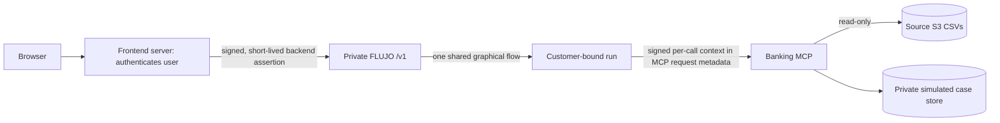

# Customer-bound banking runs in FLUJO

**Proposal, 2026-09-27.** Keep FLUJO as the workflow backend and its graphical flow as the one shared flow definition. Enhance its execution boundary so every banking tool call carries a verified, run-specific customer identity outside model text. This supersedes the gateway-as-MCP-client default in the [earlier S3 plan](BANKING_MCP_S3_PLAN.md); that route remains a fallback if the security gate fails. No FLUJO code was changed for this proposal.

## What the current checkout already offers

The inspected FLUJO checkout is `15d019f7` with unrelated working changes. Its `/v1/chat/completions` route maps into `processChatCompletion` and `runFlow`. `FlowRunInput` already has runtime-only authority concepts; `SharedState.executionAuthority` is installed non-enumerably and removed from persisted state. `MCPService.callTool` is the common dispatch path for model and Static-node calls. `tools.ts` already attaches FLUJO-owned data to `tools/call.params._meta`, and the installed MCP SDK passes request metadata to server handlers as `extra._meta`. These are useful extension points.

The existing `@conversation` reference can resolve the current conversation ID in a hidden, authoritative fixed tool parameter. That is useful for correlation. A reference with an explicit target can resolve another conversation, and a conversation ID alone proves no customer identity. The current trusted-context injector overrides a model's `conversation_id` only for FLUJO's own `create_ticket_for_human` tool. The Static node calls `MCPService.callTool` without that trusted context and does not use the Process-node preset path. Banking authorization therefore belongs at the **central dispatch and banking server**, across all call sources.

Configured HTTP MCP headers are resolved into a connection and the client pool is keyed by server name. Updating the configured header or creating a customer-specific MCP config/flow during a request would mutate shared deployment state and multiply connections. `workspace` names are data partitions, not customer authentication. The local `/v1` compatibility API key is not end-user authentication. Conversation execution locks are keyed by conversation ID, so different conversations need not serialize on one lock, but 500 concurrent runs have not been proven by this audit.

## Recommended path

1. **Authenticate at the frontend server.** It owns the browser session and sends a short-lived assertion to a dedicated banking FLUJO ingress (for example, `/v1/banking/chat/completions`). FLUJO verifies signature, issuer, audience, expiry, and a stable demo-user subject on **each** request. The `user` field, prompt, URL query, `metadata.customerId`, workspace, and requested `conversation_id` are never identity claims. FLUJO and the bank MCP remain private; only the frontend is public. The frontend backend forces the vetted banking flow and exposes only required chat/event/confirmation endpoints; the dedicated FLUJO deployment does not expose its control plane, generic filesystem/shell/conversation tools, or arbitrary flow selection to banking customers.
2. **Bind every conversation to its owner.** Atomically store `(workspace, conversation_id) -> authenticated subject` at conversation creation. On every chat turn, stream/event read, approval, cancel, retry, or resume, compare the fresh verified subject to that binding **before** loading conversation state or tool results. A supplied ID for another subject returns the same generic forbidden/unavailable response whether or not it exists. Force the banking workspace/flow from server configuration; the browser cannot select them. Re-authenticate paused/resumed runs. For the hackathon, bank-enabled scheduler, proxy, tool-tester, and unauthenticated internal runs fail closed.
3. **Introduce `TrustedRunPrincipal`.** Add a runtime-only value to `FlowRunInput` and install it non-enumerably on `SharedState`, like `executionAuthority`. It contains subject, frontend session reference, conversation ID, run ID, expiry, and allowed banking scope, **not** an AWS key or dataset customer ID. Do not put it in `variables`, prompt metadata, messages, flow snapshots, statistics payloads, or persisted conversation JSON. Explicitly propagate it to authorized subflows; deny banking tools in detached/background flows until inheritance and resume behavior are tested. Check expiry and conversation binding again immediately before tool dispatch.
4. **Authorize at one MCP dispatch seam.** Mark the banking MCP configuration as `requiresTrustedRunPrincipal`. `MCPService.callTool` rejects every protected banking call lacking that principal, regardless of whether it came from a Process node, Static node, MCP proxy, app frame, tool tester, or retry. Before invoking the SDK, FLUJO discards any caller-supplied banking `_meta` and creates a short-lived signed assertion bound to issuer, bank-MCP audience, subject, conversation, run, tool name, scope, expiry, and unique call ID. Attach it under a reserved vendor-specific `tools/call.params._meta` key; do not add it to model-authored arguments or event logs. The bank MCP connection can have a static **service** credential in its HTTP Authorization header. Its service credential alone grants no customer data: the bank server also requires and verifies the per-call assertion and rejects replayed call IDs. This is an application-specific delegation layer on top of MCP transport authorization, not an assertion that arbitrary `_meta` is trustworthy. A future general FLUJO feature could use per-request OAuth headers when the chosen SDK/transport supports them without mutating a shared connection.
5. **Enforce data ownership again in the bank MCP.** The bank server maps the verified demo subject to a dataset customer ID privately. For every result or case action, it checks transaction customer, product ID, product owner, source version, and policy. No `customer_id`, S3 key, bucket, or arbitrary URL is a tool argument. Missing/invalid assertions, expired sessions, mismatched conversations, and caller-selected foreign IDs fail closed. A case write additionally requires a frontend-issued confirmation reference tied to that subject and selected transaction, an idempotency key, and receipt read-back. The model cannot create its own confirmation by saying the customer agreed.

MCP's HTTP authorization specification requires an access token intended for the MCP resource on each HTTP request; the service credential fulfills that transport boundary in this proposed internal deployment. The signed customer assertion in `_meta` is a separate, bank-specific authorization input, validated by the bank server. If FLUJO later supports safe per-request credentials on a shared transport, use a customer-bound token in the HTTP Authorization header instead. See the [MCP authorization specification](https://github.com/modelcontextprotocol/modelcontextprotocol/blob/main/docs/specification/2026-07-28/basic/authorization/index.mdx) and the [TypeScript SDK's request metadata](https://ts.sdk.modelcontextprotocol.io/v2/api/index/%40modelcontextprotocol/client/).

## Assessment of the suggested FLUJO mechanisms

| Mechanism | Use in this design | Reason |
| --- | --- | --- |
| Dynamic MCP configs, headers, or env vars per customer | Avoid for the shared bank connection | Config is persisted/shared and the client pool is keyed by server name. Reconfiguration and 500 simultaneous users create isolation and lifecycle hazards. A static service credential is fine when every data call also requires per-run authorization. |
| Static tool nodes | Yes | Useful for deterministic sequence, policy checks, and verified receipt read-back. They still need the central dispatch guard; current Static-node calls omit trusted context. |
| Copy a template flow per customer | Avoid | Graph duplication adds no identity proof, complicates updates and cleanup, and creates unnecessary state at 500 customers. One graph can serve isolated runs. |
| Conversation metadata or `@conversation.id` | Yes, for binding/correlation | The ID locates a secure owner binding; it does not establish ownership. Hidden fixed parameters can help trace calls, while signed run context supplies authority. Never accept an explicit `@conversation[other-id]` target as authorization. |
| Narrow FLUJO branch | Recommended | Add a banking-specific ingress and trusted-run MCP adapter behind a feature flag. Preserve the graph editor, adapters, run history, and general MCP behavior. Generalize only after the security tests pass. |

### Suggested change map in FLUJO

| Seam in the inspected checkout | Narrow change |
| --- | --- |
| `src/app/v1/chat/completions/route.ts` and `chatCompletionService.ts` | Verify the frontend assertion before invoking the banking flow; pass only a server-created principal to `runFlow`. Deny unverified use of the bank flow. |
| `src/backend/execution/flow/runFlow.ts`, `types.ts`, and `persistConversationState.ts` | Bind owner to conversation; attach the principal as runtime-only state and explicitly strip it from persistence/log/model context. Reconstruct it only from a freshly verified request on resume. |
| `src/backend/execution/flow/nodes/SubflowNode.ts`, `handlers/ModelHandler.ts`, and `nodes/StaticNode.ts` | Propagate the runtime context to approved child runs and every banking tool dispatch, including deterministic Static calls. |
| `src/backend/services/mcp/index.ts` and `tools.ts` | Add the protected-server check at central dispatch; mint a signed per-call assertion and place it in request `_meta` after model arguments are finalized. Existing `_meta.flujo` is a precedent, but the new assertion needs its own key and signature. |
| `src/app/v1/chat/conversations/...` and event/approval routes | Check the subject against the durable conversation owner before reading, streaming, modifying, or resuming state. Block customer access to unrelated routes at the frontend as well. |
| Banking MCP server | Require service authentication plus signed customer context on every protected tool; map subject to dataset owner and recheck every source row. |

## 500 parallel customers

Auth state is immutable per run; one flow definition and a small number of pooled MCP connections serve many customers. Never swap global headers or use a process-global `currentCustomer`. The existing per-conversation lock should serialize concurrent updates to one conversation while allowing different conversations to run independently. Multiple FLUJO replicas require sticky routing or a shared lock/queue for the **same** conversation because the inspected lock map is process-local; bank MCP remains stateless for reads and uses a transactional shared case store for writes.

The prior 31-day raw scan is a poor 500-user serving plan: at the audit's average daily transaction-object size, 500 simultaneous 31-day scans mean about **15,500 source GETs and 11 GB transferred** before model calls. Build a private, source-versioned **customer-to-date index** from the read-only S3 data. For a request, the bank MCP reads the subject's private date index and fetches only source daily objects that can contain that customer's rows, then repeats row-level ownership checks. Store the index in a private application bucket or database; never in the organizer's read-only source bucket. It narrows reads while the actual transaction facts still come directly from source S3. The 150,000 customers share 4.43 million transactions across 1,097 dates, so a typical 31-day window should touch far fewer than 31 daily files for a single customer; measure skew and hot dates rather than relying on that average. If measured load still misses the target, build a carefully validated byte-range index or S3 customer-sharded read model; label any snapshot delay explicitly. Bound S3 concurrency, bytes, model calls, memory, and retries per run. Test 1, 50, and 500 concurrent customers and report p50/p95 latency, S3 GETs/bytes, queue time, errors, memory, provider limits, and cross-customer disclosures. No static code inspection can certify a 500-run latency target.

## Security and implementation gates

1. **Ingress and conversation gate:** two seeded subjects; create, resume, events, approval, cancel, and retries. Foreign conversation IDs, URL/query switches, workspace switches, forged metadata, and expired assertions must never reveal another conversation or cause a bank call.
2. **MCP context gate:** Process and Static nodes, subflows, retries, MCP proxy, direct tool-test APIs, and missing-context runs. Only a verified run produces a signed banking assertion; every other path fails before dispatch. Verify both installed v1 and beta-v2 MCP client paths preserve the custom request metadata. Verify debug traces and model messages contain no assertion.
3. **Bank server gate:** reject forged/replayed/expired/wrong-audience assertions and mismatched tool scopes; then check customer/product/transaction ownership independently. Cross-customer IDs and source links return no data. Write confirmation, idempotency, uncertain-write retry, and receipt read-back must pass.
4. **Load gate:** 500 interleaved subjects with randomized foreign-ID probes while measuring throughput and latency. Include concurrent turns in one conversation, MCP reconnects, FLUJO restart/resume, and S3 object changes. Zero observed cross-customer disclosure/action is a release gate; performance has an explicit measured target agreed before deployment.

**Implementation order:** ingress and owner binding; runtime principal; central MCP guard and signed metadata; bank-side verification; static/write path; customer-to-date index; isolation and load tests. The frontend backend can call FLUJO throughout. The direct frontend-to-bank-MCP route stays available only as a tested fallback if the FLUJO gate cannot be completed safely before the submission.
