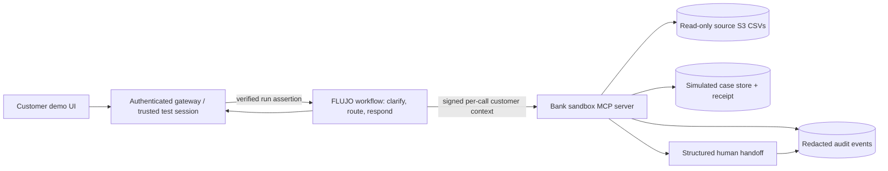

# Factored AI & Data Hackathon 2026 — FLUJO audit and plan

> **Current direction:** [the coordinated September 28 plan](BANKING_MCP_NEXT_STEPS.md)
> supersedes this audit's banking-specific ingress and per-chat direct-S3 proposals.
> Challenge requirements and data findings remain evidence; implementation status
> and delivery dates below are historical planning context. Its banking-specific
> ingress proposal is not the preserved implementation; the owner-authorized
> separate branch contains the later combined #530/#532/#533 source. See the
> [FLUJO product boundary](FLUJO_PRODUCT_BOUNDARY.md) and
> [deployment source map](FLUJO_HACKATHON_DEPLOYMENT.md).

**Prepared:** 2026-09-25; **updated after direct S3 full-table profiling:** 2026-09-26. **Recommendation:** build a **verified unrecognized-charge inquiry and simulated dispute-intake assistant** using FLUJO as the orchestrator and a small, purpose-built banking sandbox behind MCP. The outcome we automate is a correctly answered transaction inquiry or a **verified dispute-intake receipt**. We do not claim that opening a case resolves the underlying dispute. The measured full-table evidence, method, and revised decisions are in [DATA_REVIEW_2026-09-26.md](DATA_REVIEW_2026-09-26.md).

**September 27 implementation update:** [BANKING_MCP_S3_PLAN.md](BANKING_MCP_S3_PLAN.md) specifies direct, bounded reads from the source S3 CSVs through the banking MCP server. The [FLUJO banking run design](FLUJO_BANKING_RUN_AUTH.md) proposes a verified per-run principal and signed per-call banking context so FLUJO can remain the workflow backend for multiple customers. These supersede the earlier private indexed-extract and gateway-as-MCP-client choices; the workflow and data-quality findings below remain in force.

**September 27 second review:** the [source review and executed probes](FLUJO_BANKING_RUN_AUTH_REVIEW.md) revise approval/adapter propagation, shared elicitation, source-index completeness and aggregate capacity limits. Installed SDK carriers passed 500 overlapping synthetic calls; a local Static-only fixture confirmed generic `/v1` has no customer-owner boundary. Neither test proves implemented banking isolation or 500-user performance. The team's [DuckDB pipeline](../pipeline/README.md) now supplies a concrete snapshot-serving alternative; choosing it requires an explicit source/freshness contract.

## 1. What the challenge actually asks for

The problem statement asks for **one focused, end-to-end banking customer-service workflow**, supported by analysis of the supplied data, with Spanish and Portuguese interactions. The demo must show a normal case, an ambiguous or unsupported case, and a human-required case. It also asks for a learned component compared with a baseline, held-out evaluation, data contracts, access control outside the model, verified tool outcomes, and an honest route to production. Multiple agents, streaming, a new model, and a dashboard are optional, not scoring targets. [Problem statement, pp. 2–6; kickoff, pp. 10–15]

The kickoff timeline shows **challenge launch September 25 and submissions close October 5, 2026**. Submission calls for a public GitHub repository named `factored-hackathon-2026-[team-name]`, a deployed tool link, 4–6 slides, and a short video pitch, sent to the organizer's submission address in the kickoff. [Kickoff, pp. 6, 18]

**Evidence boundary at September 26:** on September 25 this directory contained only the four PDFs; on September 26 we sampled S3 through the configured MCP connection, then directly streamed **all objects in six decision-relevant table families** using read-only credentials. The bucket has 13 families; seven were inventoried but not row-profiled. At that checkpoint we had **not** measured a model, built a live FLUJO flow, or deployed a service. Counts and quality rates below refer to the six fully scanned families. For later runtime and measurements, use the [release candidate report](submission/RELEASE_CANDIDATE.md).

## 2. Focus: transaction inquiry with safe dispute intake

| Candidate | Fit to supplied data | Main trade-off |
| --- | --- | --- |
| **Unrecognized-charge inquiry → dispute intake (recommended)** | Full scan finds **12,297 `Cargo no reconocido` complaints** and 4,425,008 transactions with a clean customer/product ownership chain. | Needs a mock dispute policy and case service; complaints have no `transaction_id`, no populated originating-interaction ID, and every populated affected-product ID belongs to another customer. |
| Account/payment status inquiry only | Easy to ground in transaction records. | Less meaningful action and human handoff; risks looking like a record-lookup chatbot. |
| Card servicing | Plausible product data. | No documented card-freeze/replacement API or policy; more mock surface. |
| Credit eligibility | Full scan finds 100,102 credit cards and 31,870 loans, so product information is feasible. | Requires a separate policy decision service, fairness analysis, temporal data checks, and careful claims; high scope for ten days. |

**One customer journey:** “I do not recognize this charge.” The assistant uses a trusted test session to show only the customer’s own relevant transactions, asks the customer to select and confirm one, explains verified status and amounts, and either answers the inquiry or creates a **simulated dispute-intake case**. It reads the case back and gives the customer the verified receipt. A possible duplicate charge is an ambiguity test, not a second workflow. Suspected fraud, missing ownership, conflicting records, unsupported requests, or policy exceptions produce a structured human handoff. No refund, chargeback decision, card block, payment movement, or live banking action is in scope.

The dictionary describes larger expected counts, but the full S3 files contain 4,425,008 transactions, 686,296 interactions, 171,321 transcripts, and 67,095 complaints. The full scan confirms the unrecognized-charge complaint subtype and a clean transaction → product → customer ownership chain. **All 67,095 complaints have an empty `origin_interaction_id`**, and the table has no direct `transaction_id` field. More critically, **all 44,570 populated `affected_product_id` values point to products owned by a different customer**. Historical complaint-to-transaction matching and complaint-product enrichment are therefore off limits. Transcript and complaint text is highly templated. [Dataset summary, pp. 2–5; dictionary, pp. 8–12, 15–16; direct S3 review](DATA_REVIEW_2026-09-26.md)

**September 26 decision gate passed with conditions:** the full complaint count supports retaining this focused workflow, and all 4.43 million transactions have valid customer/product ownership. Do **not** build historical case-level attribution from complaints, use their affected-product links, or train a dispute classifier on repetitive transcripts. Customer/product master records include updates after the stated dataset cutoff, so use dated transactions for grounded inquiry facts and label master attributes as supplied snapshot values. The next gate is tested, bounded, customer-scoped direct S3 access and trusted session binding.

## 3. FLUJO capability audit

Assessed against local FLUJO source at commit `15d019f7b952b2f2d3aea1197722ac8d9f520d7c` (`main`, package version `3.46.0`). The checkout has unrelated uncommitted changes, so this is a source-capability assessment, not a clean-release certification. References below are paths in that checkout.

| Need | What FLUJO already supplies | What this team must add or prove |
| --- | --- | --- |
| Conversation and orchestration | Visual Process/MCP/Subflow/Static/Finish nodes, branching, scoped tools, per-run debugger, live usage view. `README.md`; `docs/features/flows/README.md`. | A narrow, versioned flow with explicit states and acceptance tests. Do not rely on prompts to enforce policy. |
| MCP integration | Connects local/remote MCP tools, resources, prompts; can test a tool before attaching it to an agent. `docs/features/mcp/overview.md`. | A custom **banking sandbox MCP server** with typed, bounded reads and idempotent writes. Server-side authorization and audit records are new work. |
| Multiple agents | Branches, subflows, and shared-conversation Meetings exist. `README.md`; `docs/features/subflow-session-scope.md`. | Justify any second model call by measured quality gain. A graph handoff is not a handoff to a bank employee. |
| Human escalation | `create_ticket_for_human` creates a local operator dashboard ticket with links. `docs/features/agent-tickets.md`. | Structured bank-case handoff fields, routing/acknowledgment, and receipt verification. The FLUJO ticket can illustrate the operator view but is not a bank case-management system. |
| Tool approvals | Chat can pause each call for manual approval, but approval is **off by default**. `docs/features/tool-approval.md`. | Deterministic customer authorization, confirmation, and action policy inside the service. Interactive approval is useful for demos, not a substitute for a permission boundary. |
| API and deployment | Local OpenAI-compatible flow endpoint and MCP proxy. `docs/api-reference/README.md`. | An authenticated public ingress and customer/session isolation. The ordinary local API accepts arbitrary compatibility API-key strings; FLUJO workspace partitions are not user auth. **Trusted end-user identity propagation into MCP calls is unproven** and must be tested. Never expose the local control plane or raw `/v1` endpoint publicly. |
| Data engineering and ML evidence | General flow runtime and run history, not a bank-specific ETL or measured classifier. `docs/project-status.md`. | Reproducible ingestion, contracts, labels, split, baseline, learned component, and error analysis. |
| Multilingual service | Models can be configured, but no banking Spanish/Portuguese coverage is proven by this checkout. | Human-reviewed Spanish and Portuguese cases. Supplied text is Spanish with regional variants; Portuguese examples must be team-authored and labeled separately. [Summary, p. 5; dictionary, p. 3] |
| Reliability and observability | Debugger and run history help inspect development runs. `README.md`; `docs/project-status.md`. | Exportable redacted per-case traces, bounded retries, idempotency, latency/cost accounting, monitoring, and retention policy. |

**Skill gaps to assign to people:** (1) banking dispute-policy owner to define a clearly labeled *synthetic* decision table; (2) data engineer/analyst for S3 ingestion, joins, quality checks, and demand baseline; (3) ML/evaluation owner for labels, leakage prevention, metrics, and error analysis; (4) backend/security owner for trusted sessions and per-customer tool authorization; (5) Spanish and Portuguese reviewers for natural language and handoff quality; (6) deployment/pitch owner for the public demo, slides, and video. These are work assignments, not claims that FLUJO lacks generic agent features.

## 4. Proposed architecture and trust boundaries

**MCP tool surface (draft contract):**

1. `session_context()` returns an opaque, server-verified customer binding and session expiry **only if** the deployed invocation can convey a trusted principal to the tool server outside model-authored text. The model cannot choose a `customer_id` or session token to impersonate.
2. `list_my_transactions(start_date, end_date, limit, cursor)` scans bounded source S3 date partitions; `get_my_transaction(selection_handle)` re-reads the selected partition. Both enforce ownership and return only necessary masked fields and source-as-of metadata. The handle binds the selected record to the verified customer and session.
3. `get_dispute_policy(version)` returns a clearly labeled synthetic policy with source/version. Rules such as eligible status, duplicate-case detection, and escalation conditions run in service code.
4. `create_dispute_intake(selection_handle, reason_code, confirmation_reference)` checks session, ownership, policy, required fields, and a gateway-issued confirmation. The gateway supplies an idempotency key outside model text; the service writes exactly once to a separate simulated case store and returns a case ID and receipt. A follow-up read verifies persistence before the assistant says “created.”
5. `get_my_case(case_id)` and `create_handoff(case_id_or_context, reason_code, verified_facts, unresolved_questions)` are similarly scoped. The handoff record contains only necessary facts, action receipts, source IDs, and next step.

Treat transcript text, complaint descriptions, and tool-returned free text as untrusted data. Limit result sizes, validate tool schemas, redact logs, and test prompt injection. **Enforce ownership across session customer, transaction customer, product customer, and transaction product ID; never rely on `complaints.affected_product_id` for a customer-facing tool.** Keep fraud labels, risk scores, document numbers, full account/card numbers, and historical outcome fields out of the model’s ordinary response context unless a specific tested need exists. The documented `is_fraud` field is not a customer-facing determination. [Dictionary, pp. 4–5, 8–12; problem statement, pp. 3–5; direct S3 review](DATA_REVIEW_2026-09-26.md)

**Multi-agent use:** start with one customer-facing FLUJO flow plus deterministic services. If it improves held-out results, add one read-only **evidence/policy-check subflow** to assemble source-backed facts before the response. Compare it with the single-flow baseline for unsafe outcomes, handoff quality, latency, and cost. Use parallel team/AI work during development for data profiling, policy drafting, and adversarial-case generation, with human review and a frozen test set. A “reviewer agent” must never authorize a banking action or replace service-layer checks.

**Deployment spike and hard gate:** the frontend server authenticates the test customer and calls private FLUJO through a banking-specific `/v1` ingress. The [FLUJO run design](FLUJO_BANKING_RUN_AUTH.md) verifies and binds that identity to the conversation, then signs a per-call context when FLUJO invokes the private banking MCP. Test interleaved customers, foreign conversation IDs, Static and Process nodes, pauses/resumes, and every path that can reach the bank MCP. A text prompt containing a customer ID or token is not a trusted channel. Keep FLUJO and MCP private; expose only the demo frontend. **If per-run identity propagation cannot be proven, do not deploy FLUJO with shared customer-record tools.** The frontend server can call the banking MCP directly as the fallback while FLUJO handles language and orchestration. Record which path is actually deployed.

## 5. Data, ML, and evaluation plan

**Preparation.** Direct, read-only S3 streaming through `boto3` now works; [scripts/profile_s3.py](../scripts/profile_s3.py) inventories all 13 families and fully profiles six. The current generic S3 MCP connection can list objects and read bounded daily files, but a whole-object read of the ~68 MB `products.csv` returned `Connection closed`. Use the SDK inside a narrow banking MCP service: load minimal customer/product owner maps at startup and stream only allowlisted, bounded transaction date partitions for each inquiry. The [direct S3 plan](BANKING_MCP_S3_PLAN.md) specifies the query limits, source-version handling, and identity boundary. Exclude complaint product links, because all 44,570 populated links fail ownership. Enforce types, unique IDs, owner relationships, and cutoff semantics; the full scan found zero duplicates or transaction/product ownership errors in the checked families, but 9,316 customer and 25,113 product `last_updated` values after the stated cutoff. The organizer's generic quality rates and schema-evolution notes should not be repeated as observed facts. Pin the source object manifest; label master data as a supplied snapshot unless temporal reconstruction is possible. [Summary, pp. 2–5; direct S3 review](DATA_REVIEW_2026-09-26.md)

**Demand baseline.** Use `complaints.subcategory` for unrecognized-charge demand: **12,297/67,095** full-table complaints (18.3%). Report broad interaction reasons and operational rates separately. `contact_reason` duplicated `reason_category` in all 686,296 interactions; complaint-to-interaction links were empty in all 67,095 complaints. Complaint customer-to-country joins are valid; complaint affected-product ownership joins are not. Survey coverage remains unprofiled. State denominators and missingness. Historical outcomes motivate the problem; they are **not** a measured improvement caused by the prototype.

**Learned component.** Evaluate a pretrained model's **intent and slot extraction** for realistic Spanish and Portuguese unrecognized-charge requests against deterministic keyword/slot rules on the same frozen, human-labeled cases. The full transcript table has only **42 exact customer-text strings across 171,321 rows**, all language tags are `es`, and 95.1% of intent tags are generic `consulta_general`; the full complaint table has only **five exact description strings**. They are unsuitable as a credible dispute-intent training or gold-label corpus. Write and review realistic test requests, separate paraphrase families/authors between development and holdout, lock model/prompt versions, and report intent precision/recall, slot exactness, abstention, and errors. Do not use historical resolution, escalation, or complaint outcomes as inference features. [Direct S3 review](DATA_REVIEW_2026-09-26.md)

**End-to-end test set.** Target at least 120 frozen cases, balanced across normal answer/intake, ambiguity, human escalation, and invalid/adversarial cases. Include expired sessions, cross-customer IDs, missing/stale/duplicate transactions, injected instructions in text/tool results, MCP timeout, retry after uncertain write, and mixed-language requests. Write and human-review realistic Spanish and Portuguese customer utterances; use dataset records only as permitted factual fixtures, not as a source of diverse intent wording. Record each case's origin and label quality. Compare a deterministic/rule-only workflow with the proposed system on the **same cases**.

**Report with numerator and denominator:** safe automated inquiry resolution; verified intake completion (separate from dispute resolution); attempted-automation share; unsafe disclosure/action count; missed and unnecessary handoffs; completeness of handoff packet; p50/p95 end-to-end latency; model/tool cost per attempt and per successful in-scope outcome. Break out Spanish vs Portuguese and authorized segments/countries where sample sizes allow. Include failures and repeated-run variance. Zero observed unsafe events in a small test does not prove zero risk. Label all results as offline/simulated. [Problem statement, pp. 5–6]

## 6. Tool choices: smallest useful stack

| Tool | Use now? | Why |
| --- | --- | --- |
| Direct S3 SDK (`boto3`) | **Yes; already working for profiling** | Stream source objects for reproducible profiling and bounded, direct banking-service reads. [scripts/profile_s3.py](../scripts/profile_s3.py) is the aggregate-only scan. Do not give the customer agent generic S3 access. |
| [DuckDB](https://duckdb.org/docs/stable/data/csv/overview) | Optional | Offline analysis only if it speeds development. The customer-facing MCP path reads bounded source S3 objects directly. |
| Python + [scikit-learn](https://scikit-learn.org/stable/modules/model_evaluation.html) | Optional | Metrics and group-aware evaluation helpers if useful. Do **not** train a transcript-text classifier on the observed repetitive text/coarse labels. The primary learned component is the evaluated pretrained model in FLUJO. |
| Existing FLUJO TypeScript/Zod + [MCP SDK documentation](https://ts.sdk.modelcontextprotocol.io/server) | **Yes** | Build a narrow local MCP server using the SDK version already installed in FLUJO; verify the exact transport/API against that version before coding. |
| [Playwright](https://playwright.dev/docs/intro) | **Yes, small scope** | One deployed end-to-end smoke test for Spanish normal, Portuguese normal, and handoff. FLUJO already has Playwright in its development stack. |
| [Promptfoo](https://www.promptfoo.dev/docs/red-team/configuration/) | Optional | Generate extra Spanish/Portuguese adversarial prompts and prompt-injection probes. Human-labeled frozen cases remain the primary evaluation. |
| [OpenTelemetry](https://opentelemetry.io/docs/languages/js/) | Optional | Add trace IDs across gateway, flow, and MCP service if FLUJO run records alone cannot produce the needed latency/failure evidence. |

Avoid a vector database, new model training stack, streaming platform, or multi-cloud deployment unless data profiling shows a concrete need. The challenge explicitly allows batch processing and does not reward tool count. [Problem statement, p. 4]

## 7. Ten-day delivery sequence

| Date | Output / exit criterion |
| --- | --- |
| **Sep 25** | Lock scope and synthetic-policy assumptions; inventory data access and submission requirements; protect credentials and dataset. |
| **Sep 26** | Complete the [direct S3 full-table review](DATA_REVIEW_2026-09-26.md) of six key families; retain unrecognized-charge focus, reject transcript-trained intent classification, and record missing/broken historical case links. |
| **Sep 27** | Specify the direct S3 query contract and typed MCP tools; label master-table values as supplied snapshots, pin source lineage, and reject complaint affected-product links. |
| **Sep 28** | Trusted frontend session, FLUJO run principal, and read-only MCP tools; prove frontend-to-FLUJO-to-MCP binding and pass cross-customer/expired-session tests. |
| **Sep 29** | Idempotent dispute-intake and verified read-back; structured handoff packet and simulated operator queue. |
| **Sep 30** | FLUJO flow with clarification, source-backed responses, guarded action path, Spanish/Portuguese demo cases. |
| **Oct 1** | Manually reviewed labels; rule baseline and learned component; freeze the held-out workload. |
| **Oct 2** | Run the paired evaluation and attack/failure cases; write error analysis, costs, latency, and language breakdown. |
| **Oct 3** | Authenticated deployment smoke test, redacted traces, retries/fallback, setup instructions. |
| **Oct 4** | Re-run from clean setup; record limitations; finish public repo, deployed link, 4–6 slides, and video. **Submit by Oct 5** per kickoff. |

**Demo script:** (1) Spanish customer checks a charge and receives a verified, grounded answer or confirmed intake receipt; (2) Portuguese customer describes an ambiguous duplicate charge and is asked to clarify; (3) suspected fraud/unauthorized access or a tool failure routes to a human with a compact verified packet. Show the failed/abstained path and the trace/receipt, not just polished chat text.

## 8. Immediate risk to handle before a public repository

The **complete data dictionary PDF, page 2, contains an S3 access key and secret**. Although the document describes read-only access and the data as synthetic, the credential is still sensitive. The original is retained under ignored `private/`; the repository copy has page 2 redacted. Do not commit the original PDF, local `S3credentials.env`, extracted text, screenshots, credential-bearing commands, raw dataset, or logs. The local `.gitignore` excludes the env file, private directory, and data directory. Ask organizers to rotate a key if it has already been exposed. This audit intentionally omits credential values and bucket identifier. [Redacted dictionary](reference/LATAM_Bank_Complete_Data_Dictionary_REDACTED.pdf); problem statement, p. 5.

## Source register

- `Datathon_2026_Kickoff.pdf`: timeline p. 6 (rendered slide image), challenge pp. 10–15, submission pp. 18–20.
- `Factored AI & Data Hackathon 2026 (1).pdf`: requirements and evaluation pp. 2–6.
- `LATAM_Bank_Dataset_Summary (1).pdf`: described scale, quality, language, table inventory pp. 2–5.
- [Redacted data dictionary](reference/LATAM_Bank_Complete_Data_Dictionary_REDACTED.pdf): schema and relationships pp. 3–16; original p. 2 contained credentials and is omitted from the repository copy.
- Local `FLUJO` checkout at commit above: `README.md`, `docs/project-status.md`, `docs/api-reference/README.md`, `docs/features/flows/README.md`, `docs/features/mcp/overview.md`, `docs/features/agent-tickets.md`, `docs/features/tool-approval.md`, `docs/features/subflow-session-scope.md`.
- Direct S3 scan: [scripts/profile_s3.py](../scripts/profile_s3.py) and [aggregate JSON](DATA_PROFILE_AGGREGATES_2026-09-26.json), both from 2026-09-26.
