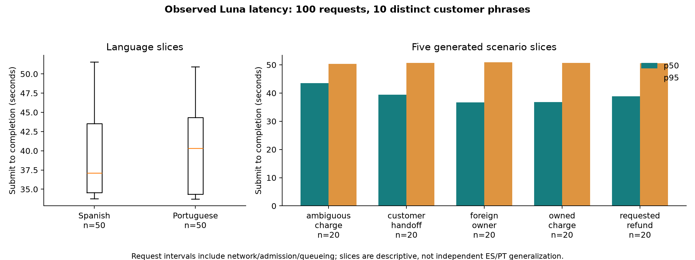
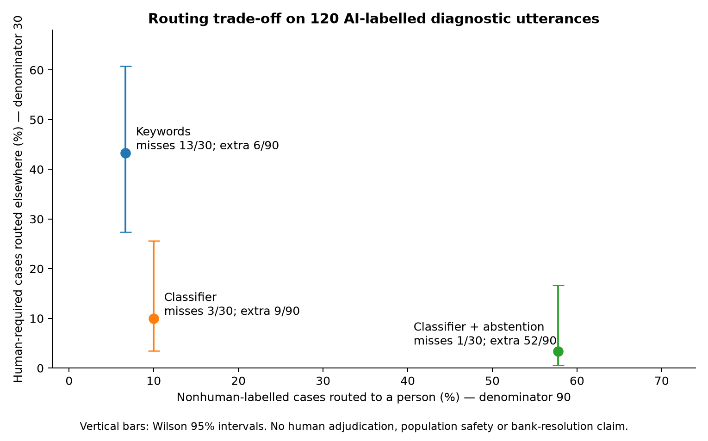

# Operating decisions from measured evidence

This analysis reads existing public artifacts and recomputes their aggregates. It makes **zero provider requests** and changes no model, threshold or source data. [Machine-readable calculations and input hashes](operating-decisions.json) keep the three workloads separate. Reproduce with `python scripts/analyze_operating_evidence.py --out docs/review` (Python, NumPy and Matplotlib; plotting version recorded in the receipt).

| Evidence → denominator | Observed result | Operating decision supported |
| --- | --- | --- |
| [Actual Luna requests](../submission/measurements/luna-100/run-100/requests.jsonl) → 100 generated cases; 50 ES/50 PT, 20 per scenario; **10 distinct phrases**, each repeated with varied facts | 100 exact-correct and bounded-safe; deterministic baseline also 100/100 | Keep ownership, candidate matching and no-write rules in deterministic trusted code. This test demonstrates a structured provider path and does not establish that an LLM improves those decisions or scales customer investigations. |
| Same 100 actual request intervals → submission through completed app-server turn | p50 37.400s, p95 50.693s, maximum 51.557s | Treat this 100-request configuration as background work requiring visible progress. It is not evidence for a conversational latency promise. ES/PT/scenario slices below identify observed tails without attributing them causally to language. |
| Same 100 per-thread token receipts → input count includes cached tokens | 1,326,179 input, 5,217 output; 868,608 cached (65.5% of input); 457,571 uncached | Inspect the default Codex instructions/schema context before scaling: 254.2 input tokens per output token on short bounded replies. Cache behavior belongs in capacity/cost reporting. Subscription dollar cost is **unknown**; token counts cannot become a free-inference or dollar-saving claim. |
| [Frozen router reproduction](router-replay.json) → 120 proposed AI labels, including 30 human-required and 90 nonhuman-labelled cases | Classifier 94/120 vs keywords 70/120; paired improvement 20 percentage points (95% bootstrap interval 10–30). Misses: 3/30 vs 13/30 | Learned routing distinguishes these authored examples better than keywords. Retain independent human adjudication as an acceptance gate; this is an already inspected diagnostic, not a fresh blind test or deployed quality rate. |
| Fixed tau=.65 on the same diagnostic → no tuning | Abstention reduces human-required misses from 3/30 to 1/30 while increasing unnecessary human routes from 9/90 to 52/90: **43 additional human routes** | Evaluate safety misses and handoff capacity together. The measured burden rules out promoting abstention based on the miss count alone. Do not tune on this known workload. |
| [Published pipeline manifest](../pipeline/manifest.json) → 44,570 non-null affected-product links out of 67,095 complaints | All 44,570 affected-product links join to a product owned by a different customer, although all referenced products exist | Do not ground a complaint in the product link merely because its foreign key exists. Enforce customer ownership and prefer owned transactions. Public synthetic replay/tests independently prove the exclusion mechanism; private source counts were **not** recomputed here. |
| Same published manifest → 171,321 transcript rows but **42 distinct normalized texts**; 2,946 test rows | 2,946/2,946 held-out rows reuse text seen in train (100% template overlap) | Reject a random-row or time-only split's text-generalization claim. Use independent utterances and label review for the intent component; keep supplied transcript labels outside a learned safety claim. The historical [ML assessment](../../ml/README.md) also reports text-only label agreement bounded near the majority baseline. |
| [Actual original customer comparison](../submission/measurements/final-comparison-counted.json) → n=3 across recorded source boundaries | HTTP200 and exact saved history 3/3; agent-screened useful answers 2/3; human adjudication pending | Transport success and persistence do not imply useful answers. Preserve the Portuguese selected-fact failure as an error; retain selected transaction scope across decomposition. Report usefulness separately from HTTP success. |
| [Post-fix Portuguese record](../submission/measurements/post-fix-pt-selected-counted.json) → separate n=1 and revision | Useful selected-fact display, HTTP200/exact history, 18.808s; guarded deterministic host fallback | Credit the recovery path and its latency. Keep it separate from n=3 and from accepted free-form model generation; this is no causal quality or speedup estimate. |

The original n=3 records contain 22 actual model-stage calls and disclosed token observations; dollar costs remain absent. Their browser-request boundary, model/provider and revisions differ from Luna's app-server benchmark, so latencies, success counts and token totals are not pooled. Live human pickup, repeat-contact reduction, refund/bank resolution and sustained reliability remain unmeasured. These decisions use the evidence that exists; they do not assign Savia a new judging score.
