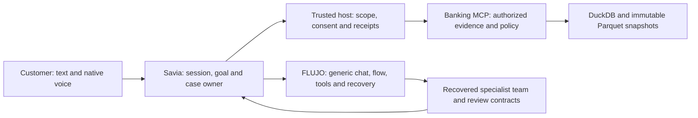

# Savia: how we built the product

**Public development story · refreshed 5 October 2026 · America/Bogota**

Savia brings a customer's question, verified banking facts, specialist investigation,
voice and saved follow-through into one Spanish and Portuguese experience. The team
built it by combining human product and policy decisions with parallel agent-assisted
implementation, independent review and recorded execution. FLUJO supplies a reusable
orchestration foundation; Savia demonstrates how that foundation becomes a focused
application without narrowing the platform to one industry.

The engineering story has substance at every layer:

| Achievement | Why it matters | Inspect the evidence |
| --- | --- | --- |
| **5.9 million rows** prepared through bronze, silver and gold | A repeatable data product with contracts, lineage, quarantine and atomic publication | [Pipeline and measured run](../../pipeline/README.md), [manifest](../pipeline/manifest.json) |
| **500/500** historical customer requests with real Sol model calls | Independent customer-oracle, MCP-result and persisted-state checks under bounded admission | [Banking acceptance and exact scope](../BANKING_MCP_IMPLEMENTATION.md#current-model-capacity) |
| **300/300** correct parallel FLUJO requests in the neutral-reference repeat | A measured orchestration and inference foundation behind the customer example | [Capacity report](measurements/INFRASTRUCTURE_CAPACITY.md), [aggregate receipt](measurements/infrastructure-capacity.json) |
| **18 Fly leaf sandboxes live together** in a recovered collaboration run | Actual teams, tools, shared findings and result checking | [Sandbox collaboration evidence](measurements/INFRASTRUCTURE_CAPACITY.md#real-sandbox-and-collaboration-runs) |
| **100/100 correct and bounded-safe Luna responses** | A frozen bilingual fixture oracle, independent audit and 100 overlapping subscription app-server turns | [Luna benchmark](measurements/luna-100/README.md), [independent audit](measurements/luna-100/run-100/audit.json) |
| **Recorded customer answers, two real reviewers, native speech and retained context** | Working product behavior that a reviewer can inspect directly | [Customer journey](CUSTOMER_JOURNEY.md), [native proof](measurements/intended-savia-native/README.md), [saved recommendation speech](measurements/saved-recommendations-native/README.md) |

These measurements describe different workloads and source revisions. Together they
show a substantial implemented product and a tested platform foundation. The capacity
tests measure concurrently submitted requests; the sandbox run measures actual worker
collaboration. Neither is a completed 100-agent Savia customer investigation.

## The people and their contributions

| Contributor | Contribution supported by repository evidence |
| --- | --- |
| **Carlos Diaz** (`cdiazcastilla`) | DuckDB pipeline, contracts, quality diagnostics, customer-isolated lookups, atomic snapshots, learned intent router and its keyword comparison. [PR 1](https://github.com/mario-andreschak/factored-hackathon-2026-mcg/pull/1), [PR 2](https://github.com/mario-andreschak/factored-hackathon-2026-mcg/pull/2), [PR 3](https://github.com/mario-andreschak/factored-hackathon-2026-mcg/pull/3). |
| **Gloria** (`gloriayantasalc`) | Prompt flow and R0–R18 decision motor, multilingual policy resources, metadata-only agent analytics, and customer movement-period selection. [Workflow credit](../DISPUTE_IMPLEMENTATION.md), [policy source](https://github.com/mario-andreschak/factored-hackathon-2026-mcg/commit/b5d0ef2c642312314e402ab3be870aba223c81ed), [PR 49](https://github.com/mario-andreschak/factored-hackathon-2026-mcg/pull/49), [PR 50](https://github.com/mario-andreschak/factored-hackathon-2026-mcg/pull/50). |
| **Mario Andreschak** (`mario-andreschak`) | Product direction, FLUJO platform and application boundary, architecture stewardship, review and merge coordination. [Product boundary](../FLUJO_PRODUCT_BOUNDARY.md), [architecture](../architecture/system-landscape.md), [repository history](https://github.com/mario-andreschak/factored-hackathon-2026-mcg/commits/main/). |
| **Agent-assisted engineering** (`flujo-app` / `FLUJO` Git identities) | MCP and application host integration, executable workflow, recovery, frontend, native voice, deployment tooling, qualification and documentation under human direction. These Git identities identify automation, rather than additional human teammates. [Direct-host PR 31](https://github.com/mario-andreschak/factored-hackathon-2026-mcg/pull/31), [host transport PR 32](https://github.com/mario-andreschak/factored-hackathon-2026-mcg/pull/32), [integrated runtime PR 56](https://github.com/mario-andreschak/factored-hackathon-2026-mcg/pull/56). |

## From evidence to application: the milestones

### 26 September — understand the customer's data before choosing the workflow

The initial audit profiled the supplied data and challenge. It established which
facts could support a useful charge inquiry and which labels needed independent
evaluation. This made the product grounded from the start: selected transaction
facts, explicit uncertainty and a concrete next step.

Evidence: [initial audit commit](https://github.com/mario-andreschak/factored-hackathon-2026-mcg/commit/9367597bbba352ee9c745a3422a0f676931a57c7),
[aggregate data review](../DATA_REVIEW_2026-09-26.md).

### 27 September — publish a reusable data plane

Carlos implemented bronze → silver → gold processing with schema contracts,
deterministic deduplication, reconciliation and quarantine. Review added per-call
cursors, known-customer validation, safe aggregate reporting and atomic `CURRENT`
publication. The serving layer makes ownership a data contract and keeps a good
snapshot available while another build is prepared.

The recorded supplied-data run processed six tables and about 5.9 million rows.
The committed manifest's 50-customer local-disk lookup sample measured p50 38.6 ms,
p95 51.2 ms and maximum 65.4 ms. Load measurements and their separate concurrency
boundary remain in the pipeline report.

Evidence: [pipeline implementation](https://github.com/mario-andreschak/factored-hackathon-2026-mcg/commit/35b34d968c4b182f0b9b893b1973721b35017c0f),
[review improvements](https://github.com/mario-andreschak/factored-hackathon-2026-mcg/commit/0ff3a054edba8c846fbf1e32eef7063cc4c89784),
[pipeline guide](../../pipeline/README.md).

### 28–29 September — combine learned routing, human policy and authorized tools

Carlos added an inspectable TF-IDF/logistic intent router with training-only model
selection and a keyword baseline. On the frozen 120-case ES/PT diagnostic holdout,
the raw learned router scored 78.3% against 58.3% for keyword rules. The abstention
variant reduced human-required misroutes to 1/30, making the safety/coverage tradeoff
visible. The utterances and labels are AI-authored; this is a component diagnostic
with human adjudication pending.

Gloria supplied the prompt flow and decision motor. In parallel, the banking MCP
implemented customer-bound reads, revocation and persisted handoff. Historical
FLUJO/Sol acceptance reached 500/500 real customer requests, with independent oracle
and ownership audits. The report retains the earlier attempts and the exact revision
of the successful run.

Evidence: [router commit](https://github.com/mario-andreschak/factored-hackathon-2026-mcg/commit/5f25097050991389f4a6a84b23f17120d45295c3),
[diagnostic comparison](../demo/intent_router_evaluation.md),
[Gloria's policy commit](https://github.com/mario-andreschak/factored-hackathon-2026-mcg/commit/b5d0ef2c642312314e402ab3be870aba223c81ed),
[500-customer acceptance commit](https://github.com/mario-andreschak/factored-hackathon-2026-mcg/commit/0a3ab0d856e4837b3794a349e404153c44cffe8b).

### 29 September — make the verified workflow usable by a customer

The first Savia portal connected real snapshot data and chat. The charge journey
then brought selected facts, confirmation, simulated intake, receipt read-back,
human handoff and recovery into a customer-facing flow. Spanish and Portuguese
controls, date explanations and replay-safe request identities made the experience
fit the underlying data and authorization contracts.

Evidence: [portal PR 11](https://github.com/mario-andreschak/factored-hackathon-2026-mcg/pull/11),
[charge journey PR 23](https://github.com/mario-andreschak/factored-hackathon-2026-mcg/pull/23),
[completed journey source](https://github.com/mario-andreschak/factored-hackathon-2026-mcg/commit/2e9a92a5329b1c7eae4c60ff96cdaddfdade1612).

### 30 September–1 October — turn the integration into an extensible architecture

The team made the product boundary explicit: FLUJO main remains general purpose,
while Savia and Banking MCP own banking data, policy, consent and action authority.
The trusted Savia host uses existing generic interfaces, resolves owned selections,
signs exact MCP calls and verifies receipts. Models receive permitted display facts;
signing keys and capabilities stay with the application and tools.

The combined renamed workflow checkpoint recorded 1,725 passed tests and 428 passed
subtests, 80 UI tests, a production build and source-hash checks. Those are dated
source and fictional-preview qualifications, rather than a claim about every later
deployed revision. Windows and Linux execution environments, graph compilation,
runtime installation and customer recordings have separate receipts.

Evidence: [boundary PR 29](https://github.com/mario-andreschak/factored-hackathon-2026-mcg/pull/29),
[direct-host PR 31](https://github.com/mario-andreschak/factored-hackathon-2026-mcg/pull/31),
[host transport PR 32](https://github.com/mario-andreschak/factored-hackathon-2026-mcg/pull/32),
[source qualification](../qualification/dispute-naming-source-2026-10-01.json).

### 1–3 October — improve operation, reviewability and daily use

The development loop added immutable source/image checks and resource-bounded
Windows/Docker Linux CI. Gloria's metadata-only analytics classified outcomes without
exporting private chat bodies. Her transaction-period selector made historical
movement review useful. Accessibility, Spanish/Portuguese labels, retained history
and independent service dependency environments received focused checks.

The team also built a local development replay with timestamped source records,
execution graphs and privacy filters. This public story presents the shareable
repository evidence in a smaller form.

Evidence: [analytics PR 49](https://github.com/mario-andreschak/factored-hackathon-2026-mcg/pull/49),
[period selection PR 50](https://github.com/mario-andreschak/factored-hackathon-2026-mcg/pull/50),
[CI method](../LOCAL_CI.md),
[replay implementation](https://github.com/mario-andreschak/factored-hackathon-2026-mcg/commit/38dc6bb48c188648e2266638e29e8ecd5ecb4ec5).

### 4–5 October — deliver one coherent voice and investigation experience

Googly eyes and calm Moss voice moved into the Savia dialog. Durable inquiries,
two real structured-model reviewers, saved suggestions and helpful acknowledgment
made the customer story extend beyond one answer. Native playback receipts verify
complete foreground reassurance and a queued informational closure. The next
release added an ordinary **Escuchar recomendaciones** control, with 8.2 seconds
of actual saved-advice speech and retained context after reload.

Alongside the customer application, the team published the existing infrastructure
capacity results: a 300/300-correct neutral-reference FLUJO repeat, real tools and
recovered Fly collaboration. The fleet connector binds Savia inquiries to native
runs and reviewed findings. The ten-Machine, one-lead-plus-nine-specialist design
extends the same contracts; its exact 100-agent customer completion remains a
separate qualification.

Evidence: [final-day PR 53](https://github.com/mario-andreschak/factored-hackathon-2026-mcg/pull/53),
[integrated runtime PR 56](https://github.com/mario-andreschak/factored-hackathon-2026-mcg/pull/56),
[saved speech PR 59](https://github.com/mario-andreschak/factored-hackathon-2026-mcg/pull/59),
[fleet connector PR 62](https://github.com/mario-andreschak/factored-hackathon-2026-mcg/pull/62),
[capacity evidence PR 74](https://github.com/mario-andreschak/factored-hackathon-2026-mcg/pull/74),
[current submission and source map](RELEASE_CANDIDATE.md).

### 5 October — give reviewers a fresh, reproducible evidence package

The final evidence sprint completed **100/100 exact-correct and bounded-safe Luna
responses**, split evenly between Spanish and Portuguese, across five frozen
fixture scenarios. One hundred app-server turns overlapped; submit-to-completion
latency was p50 37.400 seconds and p95 50.693 seconds. An independent offline
baseline and audit matched the frozen oracle. This is a direct subscription
provider benchmark, distinct from cooperating agents or the deployed Savia path.

A separate provider-free replay passed **67/67 existing offline checks and eleven
pipeline/analytics invariants**. It exercises reproducible publication, late
corrections, ownership exclusions and metadata outcome calculations. Reviewers can
rerun the same public fixtures without private data or paid model access.

Evidence: [Luna workload, results and scope](measurements/luna-100/README.md),
[independent benchmark audit](measurements/luna-100/run-100/audit.json),
[public evidence replay](../review/PUBLIC_EVIDENCE.md),
[replay source and environment receipt](../review/replay-receipt.json).

## The architecture the development produced

This separation gives each layer a clear job. A new industry adapter can reuse
FLUJO's orchestration interfaces and replace Savia's domain policy/tools. A new
provider can reuse the task and evidence contracts. A larger specialist team can
reuse fleet messaging, shared findings, review and recovery. The current customer
recordings and larger infrastructure runs retain their own execution boundaries.
See the [technical architecture](../architecture/system-landscape.md),
[fleet connector](assistant/FLEET_CONNECTOR.md), and
[FLUJO product boundary](../FLUJO_PRODUCT_BOUNDARY.md).

## How to reproduce and review the work

1. **Start with the product.** Follow the [customer journey](CUSTOMER_JOURNEY.md)
   and inspect the successful voice and saved-result captures linked above.
2. **Trace a capability to source.** Use the milestone PRs, pipeline contracts,
   trusted-host contract and executable workflow. The
   [machine-readable story](development-process.json) supplies the same evidence map.
3. **Check the appropriate workload.** Data lookup, routing quality, real-model
   capacity, collaborating sandboxes and customer outcomes each have their own
   denominators, source revisions and latency boundaries.
4. **Use the committed verification commands.** The
   [workflow](../../.github/workflows/tests.yml) separates pipeline/MCP, frontend API,
   UI, workflow and platform-source checks. The
   [local CI method](../LOCAL_CI.md) records all eleven Windows/Linux jobs for one
   immutable head; [workflow acceptance](../DISPUTE_ACCEPTANCE.md) links dated receipts.
   The [public evidence replay](../review/PUBLIC_EVIDENCE.md) supplies a
   provider-free review command and exact source hashes.
5. **Verify the release identity.** The [release report](RELEASE_CANDIDATE.md) joins
   deployed source, image and served assets to the original recordings. Public demos
   use generated fictional customers; simulated intake and informational closure
   retain their exact meanings.

The public story contains authored summaries, contributor names, public repository
links and aggregate evidence. It includes no private team-chat export, credentials,
restricted organizer rows or customer session state. Historical and incomplete
attempts remain available in the linked reports, allowing successful evidence to be
assessed without losing provenance.
